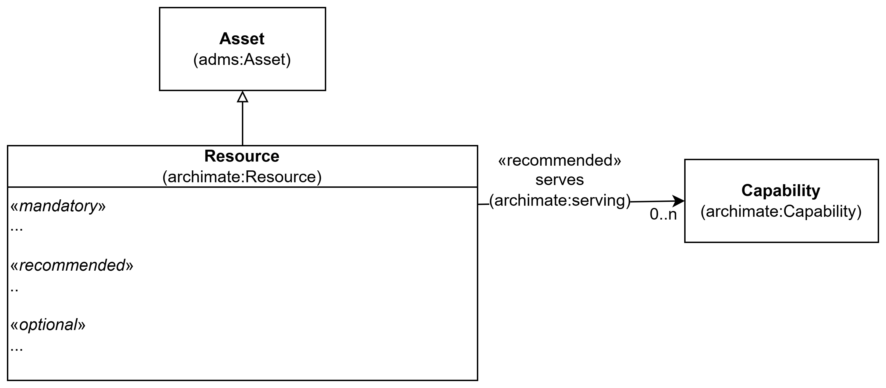

== Klassen Resource (archimate:Resource)

_#@@@@@@ mer tekst kommer ...#_

<> viser en ... _#@@@@@@ mer tekst kommer ...#_

[[img-KlassenResource]]
.Klassen Resource (archimate:Resource)
[link=images/KlassenResource.png]

_#@@@@@@ mer tekst kommer ...#_

=== Obligatoriske egenskaper for klassen _Resource_ [[Resource-obligatoriske-egenskaper]]

_#@@@@@@ mer tekst kommer ...#_

=== Anbefalte egenskaper for klassen _Resource_ [[Resource-anbefalte-egenskaper]]

_#@@@@@@ mer tekst kommer ...#_

=== Valgfrie egenskaper for klassen _Resource_ [[Resource-valgfrie-egenskaper]]

_#@@@@@@ mer tekst kommer ...#_

