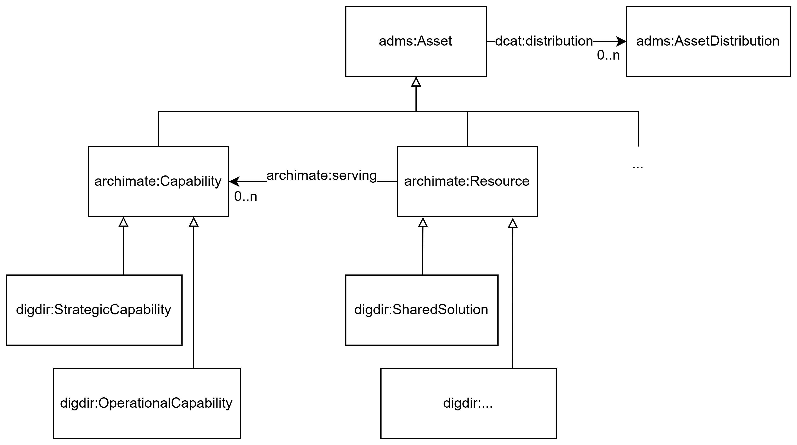

== Krav til RDF-representasjon av klassene i archADMS-AP-NO [[Spesifikasjon-per-klasse]]

_Denne delen av spesifikasjonen er primært ment for den tekniske målgruppen og forutsetter kjennskap til RDF._ 

:xrefstyle: short

<> viser en visuell oversikt over klassene i archADMS-AP-NO og relasjoner mellom dem. _#@@@@@@ mer tekst kommer ...#_

[[img-KlasseOversikt]]
.Klassene i archADMS-AP-NO
[link=images/archADMS-AP-NO-klasser.png]

//:xrefstyle: pass:[%n %t]
:xrefstyle: full

_#@@@@@@ mer tekst kommer ...#_

Kravene i denne delen av spesifikasjonen spesifiserer hvordan beskrivelsene skal representeres i RDF. Hvert krav er spesifisert i en tabell som inneholder syntaks og forklaring. Radene i tabellene er beskrevet nedenfor. Noen tabeller har færre rader. Engelske navn og tekster som er tatt med i tabellene, er ikke alle nødvendigvis ordrette sitater fra engelske kilder. Vi kan ha valgt en annen engelsk tekst til å formidle det samme budskapet, med mindre vi eksplisitt sier at det er et avvik. 

_#@@@@@@ mer tekst kommer ...#_

[cols="30s,70"]
|===
| Ledetekst i tabellen | *Hensikt med raden i tabellen*
| _English name_ | Brukes til å angi klasse- eller egenskapsnavn på engelsk, primært ment for engelsktalende utviklere av verktøystøtte.
| URI | Brukes til å angi en unik identifikator til klassen eller egenskapen.

Det er dette som skal benyttes i RDF-basert utveksling/tilgjengeliggjøring av beskrivelser som er utformet i henhold til denne standarden.

Eksempel: `skos:Concept` er identifikatoren til klassen Begrep (Concept), slik klassen er spesifisert i `skos` (<<Navnerom>> viser hva `skos` står for).
| Subklasse av / _Subclass of_ | Denne brukes bare i spesifikasjon av en klasse, til å referere til klassen som den aktuelle klassen ev. er subklasse av. 
| Subegenskap av / _Subproperty of_ | Denne brukes bare i spesifikasjon av en egenskap, til å referere til egenskapen som den aktuelle egenskapen ev. er subegenskap av. 
| Verdiområde / _Range_ | Denne brukes bare i spesifikasjon av en egenskap, til å spesifisere lovlige verdier. Disse angis ved henvisning til en klasse eller datatype.

Eksempel: Verdiområde `skos:Concept` betyr at verdien til egenskapen skal være en instans av klassen `skos:Concept`.
|Anvendelse / _Usage note_ | Brukes til å forklare hva klassen eller egenskapen er ment å brukes til, i kontekst av denne standarden. Forklaringen er også skrevet på engelsk (_Usage note_, kursivert), primært ment for engelsktalende utviklere av verktøystøtte.
| Multiplisitet / _Multiplicity_ | Denne brukes bare i spesifikasjon av en egenskap, til å spesifisere minimum og maksimum antall verdier egenskapen SKAL/BØR/KAN ha.
| Kravnivå / _Requirement level_ | Denne brukes bare i spesifikasjon av en egenskap, til å spesifisere om egenskapen er obligatorisk, anbefalt eller valgfri. Se også kap. <<Om-kravnivåene>>.
| Merknad / _Note_ | Brukes til merknader knyttet til bruk av klassen eller egenskapen, f.eks. restriksjoner hvis noen. Merknadene er også skrevet på engelsk (_Note_, kursivert), primært ment for engelsktalende utviklere av verktøystøtte.
| Eksempel | Brukes til å gi eksempel på bruken av klassen/egenskapen, i prosatekst.

Eksempel i RDF Turtle, er tatt med under den aktuelle tabellen.
|===

