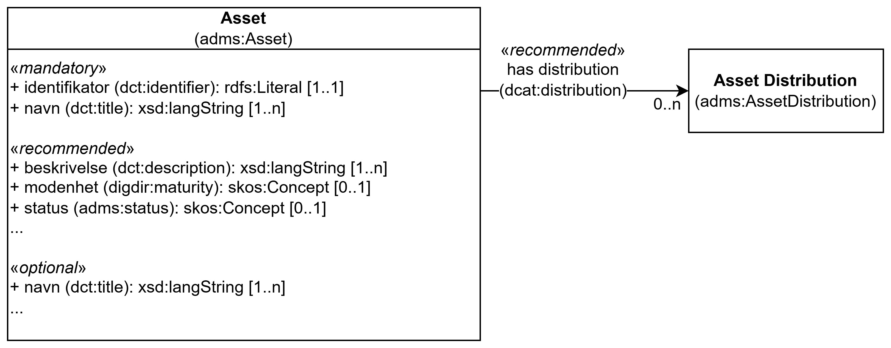

== Klassen Arkitekturartefakt (adms:Asset) [[Arkitekturartefakt]]

_#@@@@@@ klassenavnet "Arkitekturartefakt" er kun et forslag_

<> viser en ... _#@@@@@@ mer tekst kommer ...#_

[[img-KlassenAsset]]
.Klassen Arkitekturartefakt (_Asset_) (adms:Asset)
[link=images/KlassenAsset.png]

[cols="30s,70d"]
|===
| _English name_ | _Architecture artefact (Asset)_
| Anvendelse / _Usage note_ | Klassen brukes til å beskrive en arkitekturartefakt. NB! Dette er en abstrakt/generell klasse og bør ikke brukes direkte. Dens subklasser bør brukes i steden. 

_The class used to represent an Architecture Artefact. Note! This is an abstract/general class and should not be used directly. Its subclasses should be used instead._
| URI | adms:Asset
|===

=== Obligatoriske egenskaper for klassen _Arkitekturartefakt_ [[Arkitekturartefakt-obligatoriske-egenskaper]]

==== Arkitekturartefakt – identifikator (dct:identifier) [[Arkitekturartefakt-identifikator]]

[cols="30s,70d"]
|===
| _English name_ | _identifier_
| URI | dct:identifier
| Verdiområde / _Range_ | rdfs:Literal
| Anvendelse / _Usage note_ | Egenskapen brukes til å oppgi identifikatoren til arkitekturartefakten.

_This property represents an Identifier for the Architecture Artefact._
| Multiplisitet / _Multiplicity_ | 1..1
| Kravnivå / _Requirement level_ | Obligatorisk / _Mandatory_
|===

==== Arkitekturartefakt – navn (dct:title) [[Arkitekturartefakt-navn]]

[cols="30s,70d"]
|===
| _English name_ | _name_
| URI | dct:title
| Verdiområde / _Range_ |  rdf:langString
| Anvendelse / _Usage note_ | Egenskapen brukes til å oppgi navnet til arkitekturartefakten. Egenskapen BØR gjentas når navnet finnes på flere språk.

_This property represents the Name (or title) of the Architecture Artefact. This property SHOULD be repeated when the name is in parallel languages._
| Multiplisitet / _Multiplicity_ | 1..n
| Kravnivå / _Requirement level_ | Obligatorisk / _Mandatory_
|===

_#@@@@@@ mer tekst kommer ...#_

=== Anbefalte egenskaper for klassen _Arkitekturartefakt_ [[Arkitekturartefakt-anbefalte-egenskaper]]

==== Arkitekturartefakt – beskrivelse (dct:description) [[Arkitekturartefakt-beskrivelse]]

[cols="30s,70d"]
|===
| _English name_ | _description_
| URI | dct:description
| Verdiområde / _Range_ | rdf:langString
| Anvendelse / _Usage note_ | Egenskapen brukes til å oppgi en tekstlig beskrivelse av arkitekturartefakten. Egenskapen BØR gjentas når beskrivelsen finnes på flere språk.

_This property represents a free text description of the Architecture Artefact. This property SHOULD be repeated when the description is in parallel languages._
| Multiplisitet / _Multiplicity_ | 0..n
| Kravnivå / _Requirement level_ | Anbefalt / _Recommended_
|===

_#@@@@@@ mer tekst kommer ...#_

=== Valgfrie egenskaper for klassen _Arkitekturartefakt_ [[Arkitekturartefakt-valgfrie-egenskaper]]

_#@@@@@@ mer tekst kommer ...#_

