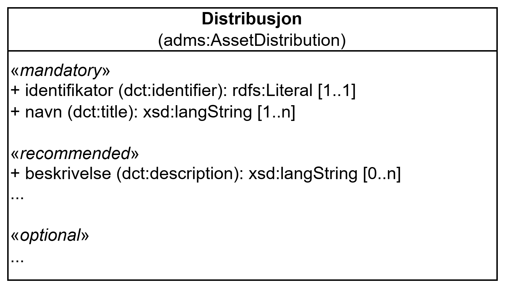

== Klassen Distribusjon (adms:AssetDistribution)

_#@@@@@@ mer tekst kommer ...#_

<> viser en ... _#@@@@@@ mer tekst kommer ...#_

[[img-KlassenAssetDistribution]]
.Klassen Distribusjon (adms:AssetDistribution)
[link=images/KlassenAssetDistribution.png]

_#@@@@@@ mer tekst kommer ...#_

=== Obligatoriske egenskaper for klassen _Distribusjon_ [[Distribusjon-obligatoriske-egenskaper]]

_#@@@@@@ mer tekst kommer ...#_

=== Anbefalte egenskaper for klassen _Distribusjon_ [[Distribusjon-anbefalte-egenskaper]]

_#@@@@@@ mer tekst kommer ...#_

=== Valgfrie egenskaper for klassen _Distribusjon_ [[Distribusjon-valgfrie-egenskaper]]

_#@@@@@@ mer tekst kommer ...#_

