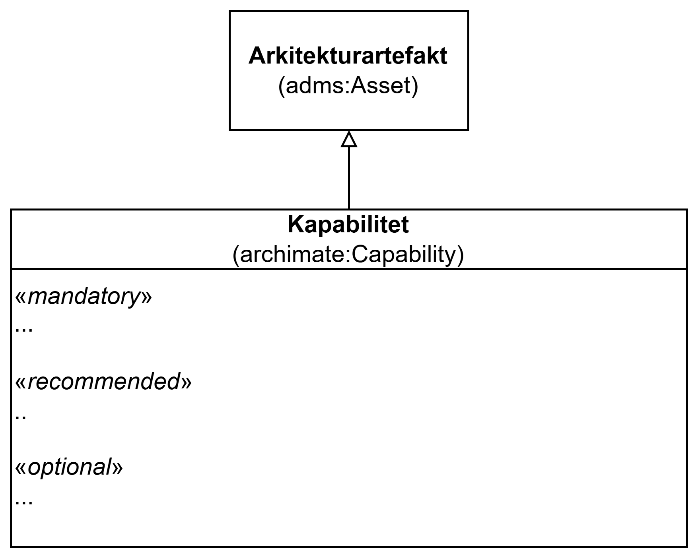

== Klassen Kapabilitet (archimate:Capability)

_#@@@@@@ mer tekst kommer ...#_

<> viser en ... _#@@@@@@ mer tekst kommer ...#_

[[img-KlassenCapability]]
.Klassen Kapabilitet (archimate:Capability)
[link=images/KlassenCapability.png]

_#@@@@@@ mer tekst kommer ...#_

=== Obligatoriske egenskaper for klassen _Kapabilitet_ [[Kapabilitet-obligatoriske-egenskaper]]

_#@@@@@@ mer tekst kommer ...#_

=== Anbefalte egenskaper for klassen _Kapabilitet_ [[Kapabilitet-anbefalte-egenskaper]]

_#@@@@@@ mer tekst kommer ...#_

=== Valgfrie egenskaper for klassen _Kapabilitet_ [[Kapabilitet-valgfrie-egenskaper]]

_#@@@@@@ mer tekst kommer ...#_

