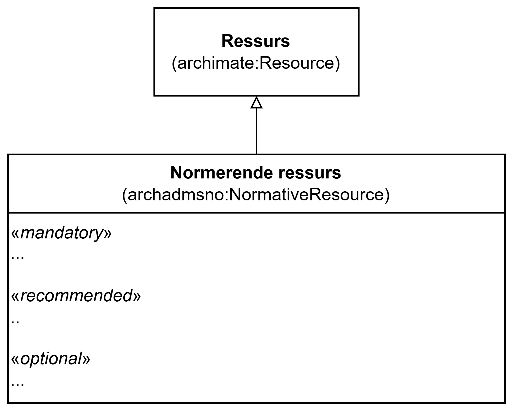

== Klassen Normerende ressurs (archadmsno:NormativeResource) [[NormerendeRessurs]]

<> viser en ... _#@@@@@@ mer tekst kommer ...#_

[[img-KlassenNormativeResource]]
.Klassen Normerende ressurs (archadmsno:NormativeResource)
[link=images/KlassenNormativeResource.png]

_#@@@@@@ mer tekst kommer ...#_

=== Obligatoriske egenskaper for klassen _Normerende ressurs_ [[NormerendeRessurs-obligatoriske-egenskaper]]

_#@@@@@@ mer tekst kommer ...#_

=== Anbefalte egenskaper for klassen _Normerende ressurs_ [[NormerendeRessurs-anbefalte-egenskaper]]

_#@@@@@@ mer tekst kommer ...#_

=== Valgfrie egenskaper for klassen _Normerende ressurs_ [[NormerendeRessurs-valgfrie-egenskaper]]

_#@@@@@@ mer tekst kommer ...#_

