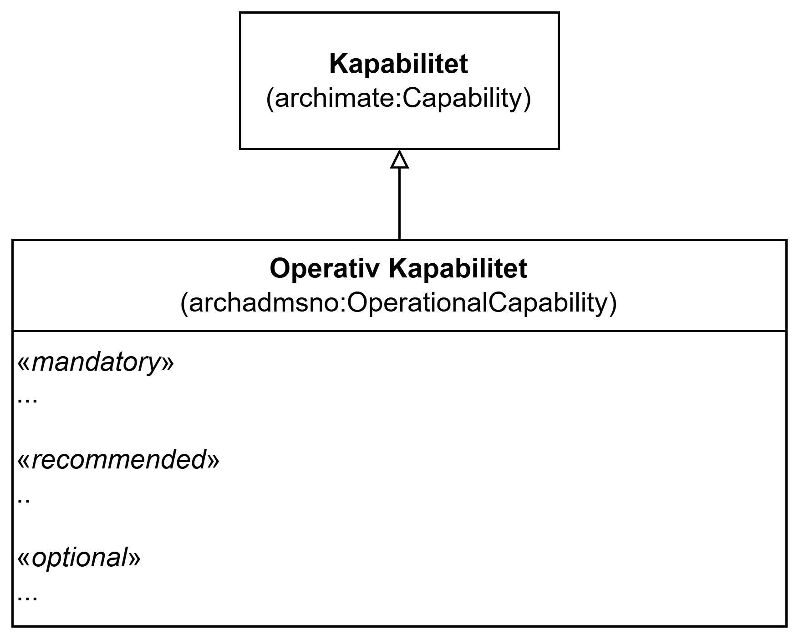

== Klassen Operativ kapabilitet (archadmsno:OperationalCapability)

<> viser en ... _#@@@@@@ mer tekst kommer ...#_

[[img-KlassenOperationalCapability]]
.Klassen Operativ kapabilitet (archadmsno:OperationalCapability)
[link=images/KlassenOperationalCapability.png]

_#@@@@@@ mer tekst kommer ...#_

=== Obligatoriske egenskaper for klassen _Operativ kapabilitet_ [[OperativKapabilitet-obligatoriske-egenskaper]]

_#@@@@@@ mer tekst kommer ...#_

=== Anbefalte egenskaper for klassen _Operativ kapabilitet_ [[OperativKapabilitet-anbefalte-egenskaper]]

_#@@@@@@ mer tekst kommer ...#_

=== Valgfrie egenskaper for klassen _Operativ kapabilitet_ [[OperativKapabilitet-valgfrie-egenskaper]]

_#@@@@@@ mer tekst kommer ...#_

