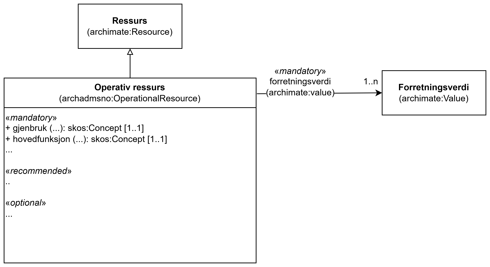

== Klassen Operativ ressurs (archadmsno:OperationalResource) [[OperativRessurs]]

<> viser en ... _#@@@@@@ mer tekst kommer ...#_

[[img-KlassenOperationalResource]]
.Klassen Operativ ressurs (archadmsno:OperationalResource)
[link=images/KlassenOperationalResource.png]

_#@@@@@@ mer tekst kommer ...#_

=== Obligatoriske egenskaper for klassen _Operativ ressurs_ [[OperativRessurs-obligatoriske-egenskaper]]

_#@@@@@@ mer tekst kommer ...#_

=== Anbefalte egenskaper for klassen _Operativ ressurs_ [[OperativRessurs-anbefalte-egenskaper]]

_#@@@@@@ mer tekst kommer ...#_

=== Valgfrie egenskaper for klassen _Operativ ressurs_ [[OperativRessurs-valgfrie-egenskaper]]

_#@@@@@@ mer tekst kommer ...#_

