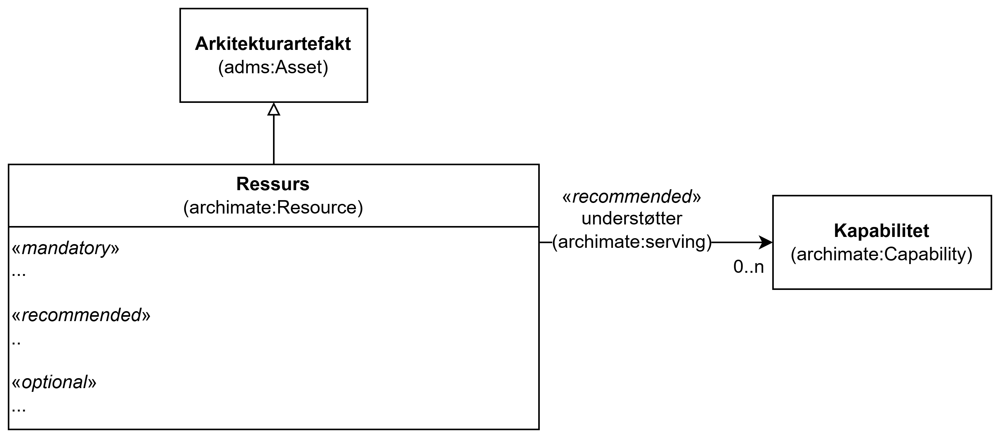

== Klassen Ressurs (archimate:Resource)

_#@@@@@@ mer tekst kommer ...#_

<> viser en ... _#@@@@@@ mer tekst kommer ...#_

[[img-KlassenResource]]
.Klassen Ressurs (archimate:Resource)
[link=images/KlassenResource.png]

_#@@@@@@ mer tekst kommer ...#_

=== Obligatoriske egenskaper for klassen _Ressurs_ [[Ressurs-obligatoriske-egenskaper]]

_#@@@@@@ mer tekst kommer ...#_

=== Anbefalte egenskaper for klassen _Ressurs_ [[Ressurs-anbefalte-egenskaper]]

_#@@@@@@ mer tekst kommer ...#_

=== Valgfrie egenskaper for klassen _Ressurs_ [[Ressurs-valgfrie-egenskaper]]

_#@@@@@@ mer tekst kommer ...#_

