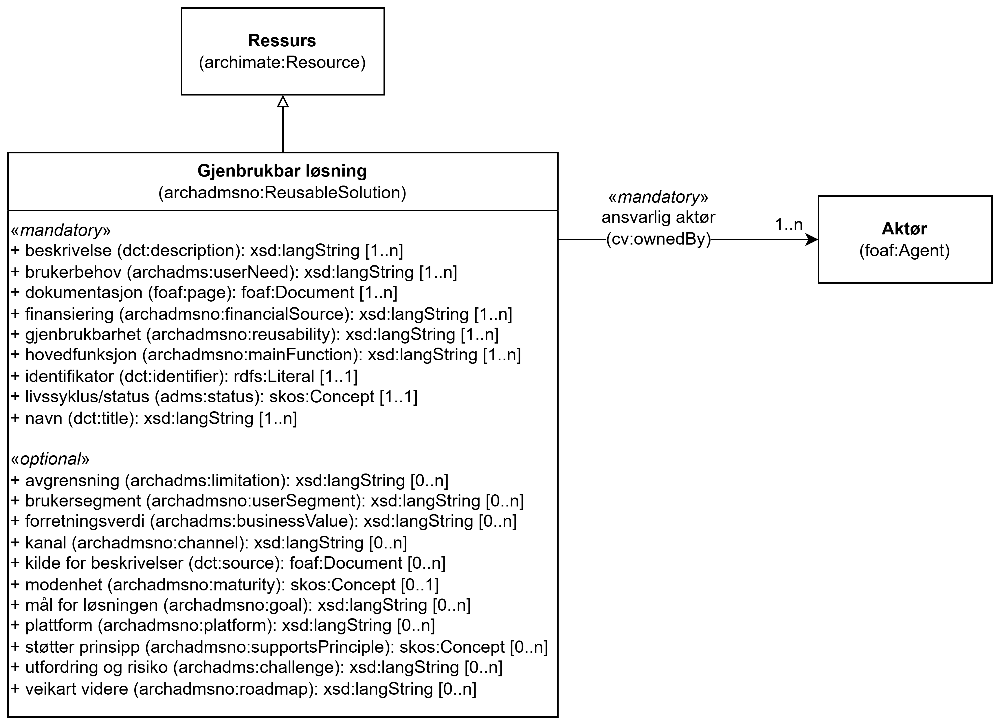

=== Klassen Gjenbrukbar løsning (`archadmsno:ReusableSolution`) [[Gjenbrukbar-løsning]]

[[img-KlassenReusableSolution]]
.Klassen Gjenbrukbar løsning (archadmsno:ReusableSolution)
[link=images/KlassenReusableSolution.png]

[cols="30s,70d"]
|===
| __English name__ | __Reusable Solution__
| URI | `archadmsno:ReusableSolution`
| Subklasse av / __Subclass of__ | Ressurs (`archimate:Resource`)
| Anvendelse / __Usage note__ | Klassen brukes til å beskrive en gjenbrukbar løsning.

__This class is used to describe a reusable solution.__
|===

==== Obligatoriske egenskaper for klassen __Gjenbrukbar løsning__ [[Gjenbrukbar-løsning-obligatoriske-egenskaper]]

===== Gjenbrukbar løsning – ansvarlig aktør (`cv:ownedBy`) [[Gjenbrukbar-løsning-ansvarlig-aktør]]

[cols="30s,70d"]
|===
| __English name__ | __owned by__
| URI | `cv:ownedBy`
| Verdiområde / __Range__ | `foaf:Agent`
| Anvendelse / __Usage note__ | Egenskapen brukes til å angi ansvarlig aktør / eier av løsningen.

__This property is used to specify the owner of the solution.__
| Multiplisitet / __Multiplicity__ | `1..n`
| Kravnivå / __Requirement level__ | Obligatorisk / __Mandatory__
|===

===== Gjenbrukbar løsning – beskrivelse (`dct:description`) [[Gjenbrukbar-løsning-beskrivelse]]

[cols="30s,70d"]
|===
| __English name__ | __description__
| URI | `dct:description`
| Verdiområde / __Range__ | `xsd:langString`
| Anvendelse / __Usage note__ | Egenskapen brukes til å angi tekstlig beskrivelse av løsningen.

__This property is used to specify the description of the solution.__
| Multiplisitet / __Multiplicity__ | `1..n`
| Kravnivå / __Requirement level__ | Obligatorisk / __Mandatory__
|===

===== Gjenbrukbar løsning – brukerbehov (`archadms:userNeed`) [[Gjenbrukbar-løsning-brukerbehov]]

[cols="30s,70d"]
|===
| __English name__ | __user need__
| URI | `archadms:userNeed`
| Verdiområde / __Range__ | `xsd:langString`
| Anvendelse / __Usage note__ | Egenskapen brukes til å angi brukerbehov for løsningen.

__This property is used to specify the user need for the solution.__
| Multiplisitet / __Multiplicity__ | `1..n`
| Kravnivå / __Requirement level__ | Obligatorisk / __Mandatory__
|===

===== Gjenbrukbar løsning – dokumentasjon (`foaf:page`) [[Gjenbrukbar-løsning-dokumentasjon]]

[cols="30s,70d"]
|===
| __English name__ | __dokumentation__
| URI | `foaf:page`
| Verdiområde / __Range__ | `foaf:Document`
| Anvendelse / __Usage note__ | Egenskapen brukes til å angi dokumentasjon for løsningen.

__This property is used to specify dokumentation for the solution.__
| Multiplisitet / __Multiplicity__ | `1..n`
| Kravnivå / __Requirement level__ | Obligatorisk / __Mandatory__
|===

===== Gjenbrukbar løsning – finansiering (`archadmsno:financialSource`) [[Gjenbrukbar-løsning-finansiering]]

[cols="30s,70d"]
|===
| __English name__ | __finansiering__
| URI | `archadmsno:financialSource`
| Verdiområde / __Range__ | `xsd:langString`
| Anvendelse / __Usage note__ | Egenskapen brukes til å angi finansieringsform for løsningen.

__This property is used to specify form of financing for the solution.__
| Multiplisitet / __Multiplicity__ | `1..n`
| Kravnivå / __Requirement level__ | Obligatorisk / __Mandatory__
|===

===== Gjenbrukbar løsning – gjenbrukbarhet (`archadmsno:reusability`) [[Gjenbrukbar-løsning-gjenbrukbarhet]]

[cols="30s,70d"]
|===
| __English name__ | __reusability__
| URI | `archadmsno:reusability`
| Verdiområde / __Range__ | `xsd:langString`
| Anvendelse / __Usage note__ | Egenskapen brukes til å angi gjenbrukbarhet av løsningen.

__This property is used to specify reusability of the solution.__
| Multiplisitet / __Multiplicity__ | `1..n`
| Kravnivå / __Requirement level__ | Obligatorisk / __Mandatory__
|===

===== Gjenbrukbar løsning – hovedfunksjon (`archadmsno:mainFunction`) [[Gjenbrukbar-løsning-hovedfunksjon]]

[cols="30s,70d"]
|===
| __English name__ | __hovedfunksjon__
| URI | `archadmsno:mainFunction`
| Verdiområde / __Range__ | `xsd:langString`
| Anvendelse / __Usage note__ | Egenskapen brukes til å angi hovedfunksjon av løsningen.

__This property is used to specify main function of the solution.__
| Multiplisitet / __Multiplicity__ | `1..n`
| Kravnivå / __Requirement level__ | Obligatorisk / __Mandatory__
|===

===== Gjenbrukbar løsning – identifikator (`dct:identifier`) [[Gjenbrukbar-løsning-identifikator]]

[cols="30s,70d"]
|===
| __English name__ | __identifier__
| URI | `dct:identifier`
| Verdiområde / __Range__ | `rdfs:Literal`
| Anvendelse / __Usage note__ | Egenskapen brukes til å angi identifikator til løsningen.

__This property is used to specify identifier of the solution.__
| Multiplisitet / __Multiplicity__ | `1..1`
| Kravnivå / __Requirement level__ | Obligatorisk / __Mandatory__
|===

===== Gjenbrukbar løsning – livssyklus/status (`adms:status`) [[Gjenbrukbar-løsning-livssyklus-status]]

[cols="30s,70d"]
|===
| __English name__ | __lifecycle/status__
| URI | `adms:status`
| Verdiområde / __Range__ | `skos:Concept`
| Anvendelse / __Usage note__ | Egenskapen brukes til å angi livssyklus/status av løsningen.

__This property is used to specify lifecycle/status of the solution.__
| Multiplisitet / __Multiplicity__ | `1..1`
| Kravnivå / __Requirement level__ | Obligatorisk / __Mandatory__
|===

===== Gjenbrukbar løsning – navn (`dct:title`) [[Gjenbrukbar-løsning-navn]]

[cols="30s,70d"]
|===
| __English name__ | __navn__
| URI | `dct:title`
| Verdiområde / __Range__ | `xsd:langString`
| Anvendelse / __Usage note__ | Egenskapen brukes til å angi navn for løsningen.

__This property is used to specify name of the solution.__
| Multiplisitet / __Multiplicity__ | `1..n`
| Kravnivå / __Requirement level__ | Obligatorisk / __Mandatory__
|===

==== Anbefalte egenskaper for klassen __Gjenbrukbar løsning__ [[Gjenbrukbar-løsning-anbefalte-egenskaper]]

Ingen anbefalte egenskaper er spesifisert.

==== Valgfrie egenskaper for klassen __Gjenbrukbar løsning__ [[Gjenbrukbar-løsning-valgfrie-egenskaper]]

===== Gjenbrukbar løsning – avgrensning (`archadms:limitation`) [[Gjenbrukbar-løsning-avgrensning]]

[cols="30s,70d"]
|===
| __English name__ | __limitation__
| URI | `archadms:limitation`
| Verdiområde / __Range__ | `xsd:langString`
| Anvendelse / __Usage note__ | Egenskapen brukes til å angi avgrensning av løsningen.

__This property is used to specify limitation of the solution.__
| Multiplisitet / __Multiplicity__ | `0..n`
| Kravnivå / __Requirement level__ | Valgfri / __Optional__
|===

===== Gjenbrukbar løsning – brukersegment (`archadmsno:userSegment`) [[Gjenbrukbar-løsning-brukersegment]]

[cols="30s,70d"]
|===
| __English name__ | __user segment__
| URI | `archadmsno:userSegment`
| Verdiområde / __Range__ | `xsd:langString`
| Anvendelse / __Usage note__ | Egenskapen brukes til å angi brukersegment for løsningen.

__This property is used to specify user segment of the solution.__
| Multiplisitet / __Multiplicity__ | `0..n`
| Kravnivå / __Requirement level__ | Valgfri / __Optional__
|===

===== Gjenbrukbar løsning – forretningsverdi (`archadms:businessValue`) [[Gjenbrukbar-løsning-forretningsverdi]]

[cols="30s,70d"]
|===
| __English name__ | __business value__
| URI | `archadms:businessValue`
| Verdiområde / __Range__ | `xsd:langString`
| Anvendelse / __Usage note__ | Egenskapen brukes til å angi forretningsverdi for løsningen.

__This property is used to specify business value of the solution.__
| Multiplisitet / __Multiplicity__ | `0..n`
| Kravnivå / __Requirement level__ | Valgfri / __Optional__
|===

===== Gjenbrukbar løsning – kanal (`archadmsno:channel`) [[Gjenbrukbar-løsning-kanal]]

[cols="30s,70d"]
|===
| __English name__ | __channel__
| URI | `archadmsno:channel`
| Verdiområde / __Range__ | `xsd:langString`
| Anvendelse / __Usage note__ | Egenskapen brukes til å angi kanal for løsningen.

__This property is used to specify channel of the solution.__
| Multiplisitet / __Multiplicity__ | `0..n`
| Kravnivå / __Requirement level__ | Valgfri / __Optional__
|===

===== Gjenbrukbar løsning – kilde for beskrivelser (`dct:source`) [[Gjenbrukbar-løsning-kilde-for-beskrivelser]]

[cols="30s,70d"]
|===
| __English name__ | __source__
| URI | `dct:source`
| Verdiområde / __Range__ | `foaf:Document`
| Anvendelse / __Usage note__ | Egenskapen brukes til å angi kilde for beskrivelser for løsningen.

__This property is used to specify source of the solution.__
| Multiplisitet / __Multiplicity__ | `0..n`
| Kravnivå / __Requirement level__ | Valgfri / __Optional__
|===

===== Gjenbrukbar løsning – modenhet (`archadmsno:maturity`) [[Gjenbrukbar-løsning-modenhet]]

[cols="30s,70d"]
|===
| __English name__ | __maturity__
| URI | `archadmsno:maturity`
| Verdiområde / __Range__ | `skos:Concept`
| Anvendelse / __Usage note__ | Egenskapen brukes til å angi modenhet av løsningen.

__This property is used to specify maturity of the solution.__
| Multiplisitet / __Multiplicity__ | `0..1`
| Kravnivå / __Requirement level__ | Valgfri / __Optional__
|===

===== Gjenbrukbar løsning – mål for løsningen (`archadmsno:goal`) [[Gjenbrukbar-løsning-mål-for-løsningen]]

[cols="30s,70d"]
|===
| __English name__ | __goal__
| URI | `archadmsno:goal`
| Verdiområde / __Range__ | `xsd:langString`
| Anvendelse / __Usage note__ | Egenskapen brukes til å angi mål for løsningen.

__This property is used to specify goal of the solution.__
| Multiplisitet / __Multiplicity__ | `0..n`
| Kravnivå / __Requirement level__ | Valgfri / __Optional__
|===

===== Gjenbrukbar løsning – plattform (`archadmsno:platform`) [[Gjenbrukbar-løsning-plattform]]

[cols="30s,70d"]
|===
| __English name__ | __platform__
| URI | `archadmsno:platform`
| Verdiområde / __Range__ | `xsd:langString`
| Anvendelse / __Usage note__ | Egenskapen brukes til å angi plattform for løsningen.

__This property is used to specify platform of the solution.__
| Multiplisitet / __Multiplicity__ | `0..n`
| Kravnivå / __Requirement level__ | Valgfri / __Optional__
|===

===== Gjenbrukbar løsning – støtter prinsipp (`archadmsno:supportsPrinciple`) [[Gjenbrukbar-løsning-støtter-prinsipp]]

[cols="30s,70d"]
|===
| __English name__ | __supports principle__
| URI | `archadmsno:supportsPrinciple`
| Verdiområde / __Range__ | `skos:Concept`
| Anvendelse / __Usage note__ | Egenskapen brukes til å angi støtter prinsipp for løsningen.

__This property is used to specify principle supported bythe solution.__
| Multiplisitet / __Multiplicity__ | `0..n`
| Kravnivå / __Requirement level__ | Valgfri / __Optional__
|===

===== Gjenbrukbar løsning – utfordring og risiko (`archadms:challenge`) [[Gjenbrukbar-løsning-utfordring-og-risiko]]

[cols="30s,70d"]
|===
| __English name__ | __challenge and risk__
| URI | `archadms:challenge`
| Verdiområde / __Range__ | `xsd:langString`
| Anvendelse / __Usage note__ | Egenskapen brukes til å angi utfordring og risiko av løsningen.

__This property is used to specify challenge and risk of the solution.__
| Multiplisitet / __Multiplicity__ | `0..n`
| Kravnivå / __Requirement level__ | Valgfri / __Optional__
|===

===== Gjenbrukbar løsning – veikart videre (`archadmsno:roadmap`) [[Gjenbrukbar-løsning-veikart-videre]]

[cols="30s,70d"]
|===
| __English name__ | __roadmap__
| URI | `archadmsno:roadmap`
| Verdiområde / __Range__ | `xsd:langString`
| Anvendelse / __Usage note__ | Egenskapen brukes til å angi veikart videre for løsningen.

__This property is used to specify roadmap for the solution.__
| Multiplisitet / __Multiplicity__ | `0..n`
| Kravnivå / __Requirement level__ | Valgfri / __Optional__
|===

