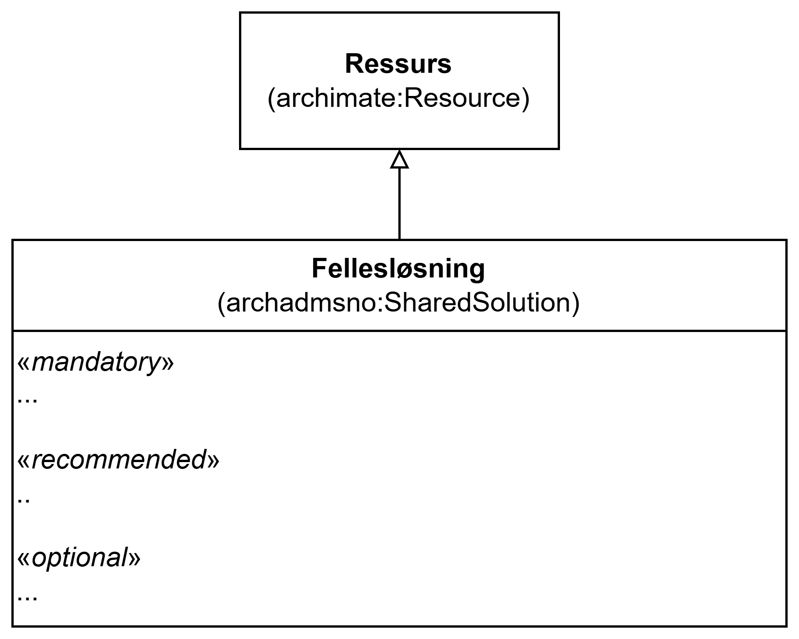

== Klassen Fellesløsning (archadmsno:SharedSolution)

_#@@@@@@ mer tekst kommer ...#_

<> viser en ... _#@@@@@@ mer tekst kommer ...#_

[[img-KlassenSharedSolution]]
.Klassen Fellesløsning (archadmsno:SharedSolution)
[link=images/KlassenSharedSolution.png]

_#@@@@@@ mer tekst kommer ...#_

=== Obligatoriske egenskaper for klassen _Fellesløsning_ [[Fellesløsning-obligatoriske-egenskaper]]

_#@@@@@@ mer tekst kommer ...#_

=== Anbefalte egenskaper for klassen _Fellesløsning_ [[Fellesløsning-anbefalte-egenskaper]]

_#@@@@@@ mer tekst kommer ...#_

=== Valgfrie egenskaper for klassen _Fellesløsning_ [[Fellesløsning-valgfrie-egenskaper]]

_#@@@@@@ mer tekst kommer ...#_

