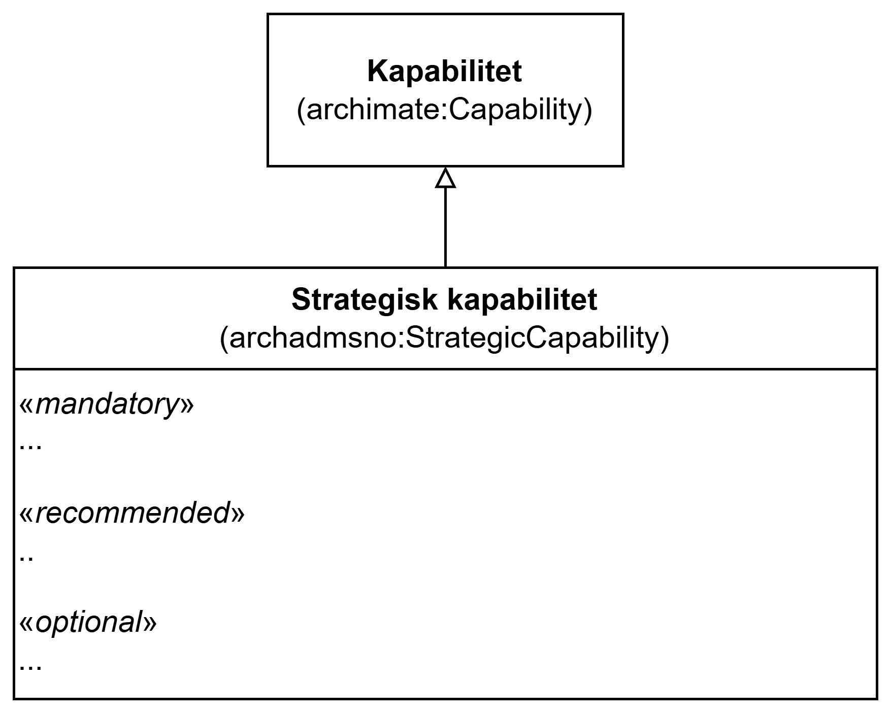

== Klassen Strategisk kapabilitet (archadmsno:StrategicCapability) [[StrategiskKapabilitet]]

_#@@@@@@ mer tekst kommer ...#_

<> viser en ... _#@@@@@@ mer tekst kommer ...#_

[[img-KlassenStrategicCapability]]
.Klassen Strategisk kapabilitet (archadmsno:StrategicCapability)
[link=images/KlassenStrategicCapability.png]

_#@@@@@@ mer tekst kommer ...#_

=== Obligatoriske egenskaper for klassen _Strategisk kapabilitet_ [[StrategiskKapabilitet-obligatoriske-egenskaper]]

_#@@@@@@ mer tekst kommer ...#_

=== Anbefalte egenskaper for klassen _Strategisk kapabilitet_ [[StrategiskKapabilitet-anbefalte-egenskaper]]

_#@@@@@@ mer tekst kommer ...#_

=== Valgfrie egenskaper for klassen _Strategisk kapabilitet_ [[StrategiskKapabilitet-valgfrie-egenskaper]]

_#@@@@@@ mer tekst kommer ...#_

