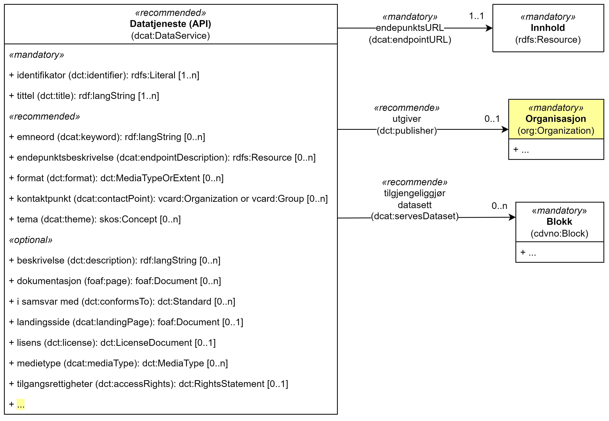

== Klassen Datatjeneste (API) (dcat:DataService) [[DataService]]

[[img-klassenDatatjeneste]]
.Klassen Datatjeneste (dcat:DataService) og klassene den refererer til. 
[link=images/cdvno-dataservice.png]

<> viser klassen Datatjeneste (`dcat:DataService`) og klassene den refererer til. Det som er #gulet# ut, er avvik fra https://data.norge.no/specification/dcat-ap-no#Datasett[klassen Datatjeneste (dcat:DataService) spesifisert i DCAT-AP-NO &#x29C9;, window="_blank", role="ext-link"]. Klassene som ikke er eksplisitt spesifisert i denne spesifikasjonen er ikke tatt med i figuren over eller i teksten under, f.eks. klassen Begrep (`skos:Concept`). 

[cols="30s,70d"]
|===
| _English name_ | _Data service_
| Anvendelse / _Usage note_ | Klassen brukes til å representere en datatjeneste som gir tilgang til en eller flere nettressurser.

_The class is used to represent a data service which provides access to one or more online resources._
| URI | dcat:DataService
| Kravnivå / _Requirement level_ | Anbefalt / _Recommended_
| Merknad / _Note_ | I tillegg til egenskapene spesifisert her, kan egenskapene til https://data.norge.no/specification/dcat-ap-no#Datatjeneste[klassen Datatjeneste (dcat:DataService) spesifisert i DCAT-AP-NO &#x29C9;, window="_blank", role="ext-link"] også brukes. 

__In addition to the properties that are specified here, the properties in https://data.norge.no/specification/dcat-ap-no#Datatjeneste[the class Data service (dcat:DataService) specified in DCAT-AP-NO &#x29C9;, window="_blank", role="ext-link"] (in Norwegian) may also be used.__
|===

Eksempel i RDF Turtle:
-----
<aDataSrvc> a dcat:DataService; # datatjeneste
   .
-----

=== Obligatoriske egenskaper for _Datatjeneste_ [[Datatjeneste-obligatoriske-egenskaper]]

==== Datatjeneste - endepunktsURL (dcat:endpointURL) [[Datatjeneste-endepunktsurl]]

[cols="30s,70d"]
|===
| _English name_ | _endpoint URL_
| URI | dcat:endpointURL
| Verdiområde / _Range_ | rdfs:Resource
| Anvendelse / _Usage note_ | Egenskapen brukes til å oppgi rotplassering eller primært endepunkt for tjenesten (en URI).

_This property is used to specify the root location or primary endpoint of the service (an IRI)._
| Multiplisitet / _Multiplicity_ | 1..1
| Kravnivå / _Requirement level_ | Obligatorisk / _Mandatory_
|===

Eksempel i RDF Turtle:
-----
<aDataSrvc> a dcat:DataService; # datatjeneste
   dcat:endpointURL <https://example.org/anAPI>;
   .
-----

==== Datatjeneste - identifikator (dct:identifier) [[Datatjeneste-identifikator]]

[cols="30s,70d"]
|===
| _English name_ | identifier
| URI | dct:identifier
| Verdiområde / _Range_ | xsd:anyURI
| Anvendelse / _Usage note_ | Egenskapen brukes til å oppgi identifikator til datatjenesten.

_This property is used to specify the identifier to the service._
| Multiplisitet / _Multiplicity_ | 1..n
| Kravnivå / _Requirement level_ | Obligatorisk / _Mandatory_
| Merknad / _Note_ | 
Identifikator er som regel systemgenerert av verktøystøtte, slik at du som vanlig bruker ikke trenger å fylle ut verdien til egenskapen manuelt. For deg som skal utvikle/tilpasse verktøystøtte, se https://data.norge.no/guide/veileder-beskrivelse-av-datasett#om-identifikator[Om identifikator (dct:identifier) i Veileder for beskrivelse av datasett osv. &#x29C9;, window="_blank", role="ext-link"]

__See https://data.norge.no/guide/veileder-beskrivelse-av-datasett#om-identifikator[Om identifikator (dct:identifier) i Veileder for beskrivelse av datasett osv. &#x29C9;, window="_blank", role="ext-link"] (in Norwegian).__
|===

Eksempel i RDF Turtle:
-----
<aDataSrvc> a dcat:DataService; # datatjeneste
   dct:identifier "https://example.org/anAPI"^^xsd:anyURI;
   .
-----

==== Datatjeneste - tittel (dct:title) [[Datatjeneste-tittel]]

[cols="30s,70d"]
|===
| _English name_ | _title_
| URI | dct:title
| Verdiområde / _Range_ | rdf:langString
| Anvendelse / _Usage note_ | Egenskapen brukes til å oppgi navnet på tjenesten. Egenskapen bør gjentas når navnet finnes på flere ulike språk.

_This property is used to specify the title of the service. This property should be repeated for parallel language versions of the title._
| Multiplisitet / _Multiplicity_ | 1..n
| Kravnivå / _Requirement level_ | Obligatorisk / _Mandatory_
|===

Eksempel i RDF Turtle:
-----
<aDataSrvc> a dcat:DataService; # datatjeneste
   dct:title "testAPI"@nb, "test API"@en; # tittel
   .
-----

=== Anbefalte egenskaper for _Datatjeneste_ [[Datatjeneste-anbefalte-egenskaper]]

==== Datatjeneste - emneord (dcat:keyword) [[Datatjeneste-emneord]]

[cols="30s,70d"]
|===
| _English name_ | _keyword_
| URI | dcat:keyword
| Verdiområde / _Range_ | rdf:langString
| Anvendelse / _Usage note_ | Egenskapen brukes til å oppgi emneord (eller tag) som beskriver tjenesten. Egenskapen bør gjentas når emneordet finnes på flere språk. 

_This property is used to specify a keyword (or tag) which describes the service. This property should be repeated for parallel language versions of the keyword._
| Multiplisitet / _Multiplicity_ | 0..n
| Kravnivå / _Requirement level_ | Anbefalt / _Recommended_
|===

Eksempel i RDF Turtle:
-----
<aDataSrvc> a dcat:DataService; # datatjeneste
   dcat:keyword "test"@nb, "API"@nb, "test"@en, "API"@en; # emneord
   .
-----

==== Datatjeneste - endepunktsbeskrivelse (dcat:endpointDescription) [[Datatjeneste-endepunktsbeskrivelse]]

[cols="30s,70d"]
|===
| _English name_ | _endpoint description_
| URI | dcat:endpointDescription
| Verdiområde / _Range_ | rdfs:Resource
| Anvendelse / _Usage note_ | Egenskapen brukes til å oppgi en beskrivelse av tjenestene som er tilgjengelige via endepunktene, inkludert deres operasjoner, parametere osv. 

_This property is sued to specify a description of the services available via the end-points, including their operations, parameters etc._ 
| Multiplisitet / _Multiplicity_ | 0..n
| Kravnivå / _Requirement level_ | Anbefalt / _Recommended_
| Merknad / _Note_ | Egenskapen gir spesifikke detaljer om de faktiske endepunkt-instansene, mens `dct:conformsTo` brukes til å indikere den generelle standarden eller spesifikasjonen som endepunktene implementerer.

_This property gives specific details of the actual endpoint instances, while `dct:conformsTo` is used to indicate the general standard or specification that the endpoints implement._
|===

Eksempel i RDF Turtle:
-----
<aDataSrvc> a dcat:DataService; # datatjeneste
   dcat:endpointDescription <https://example.org/anAPIdescr>;
   .
-----

==== Datatjeneste - format (dct:format) [[Datatjeneste-format]]

[cols="30s,70d"]
|===
| _English name_ |_format_
| URI | dct:format
| Verdiområde / _Range_ |dct:MediaTypeOrExtent
| Anvendelse / _Usage note_ | Egenskapen brukes til å oppgi datatjenestens dataformat. Egenskapen kan gjentas for datatjenester som leverer data i flere formater.

_This property is used to specify the format of the service. This property may be repeated for services that provide data in several formats._
| Multiplisitet / _Multiplicity_ | 0..n
| Kravnivå / _Requirement level_ | Anbefalt / _Recommended_
| Merknad / _Note_ | Verdien skal velges fra EUs kontrollerte vokabular https://op.europa.eu/en/web/eu-vocabularies/concept-scheme/-/resource?uri=http://publications.europa.eu/resource/authority/file-type[File type &#x29C9;, window="_blank", role="ext-link"].

__The value shall be chosen from EU's controlled vocabulary https://op.europa.eu/en/web/eu-vocabularies/concept-scheme/-/resource?uri=http://publications.europa.eu/resource/authority/file-type[File type &#x29C9;, window="_blank", role="ext-link"].__
|===

Eksempel i RDF Turtle:
-----
<aDataSrvc> a dcat:DataService; # datatjeneste
   dct:format <http://publications.europa.eu/resource/authority/file-type/RDF_TURTLE>; # format, RDF Turtle
   .
-----

==== Datatjeneste - kontaktpunkt (dcat:contactPoint) [[Datatjeneste-kontaktpunkt]]

[cols="30s,70d"]
|===
| _English name_ | _contact point_
| URI | dcat:contactPoint
| Verdiområde / _Range_ | vcard:Organization or vcard:Group
| Anvendelse / _Usage note_ | Egenskapen brukes til å referere til kontaktpunkt med kontaktopplysninger, som kan brukes til f.eks. å sende kommentarer om datatjenesten.

_This property is used to specify contact point(s) which may be used to e.g. send comments about the service._ 
| Multiplisitet / _Multiplicity_ | 0..n
| Kravnivå / _Requirement level_ | Anbefalt / _Recommended_
|===

Eksempel i RDF Turtle:
-----
<aDataSrvc> a dcat:DataService; # datatjeneste
   dcat:contactPoint [ a vcard:Organization; 
      vcard:hasEmail  <mailto:contact@example.org>; ]; 
   .
-----

==== Datatjeneste - tema (dcat:theme) [[Datatjeneste-tema]]

[cols="30s,70d"]
|===
| _English name_ | _theme_
| URI | dcat:theme
| Verdiområde / _Range_ | skos:Concept
| Anvendelse / _Usage note_ | Egenskapen brukes til å referere til et hovedtema for datatjenesten. En datatjeneste kan assosieres med flere tema. 

_This property is used to refer to a main theme for the service. A service may be associated with several themes._
| Multiplisitet / _Multiplicity_ | 0..n
| Kravnivå / _Requirement level_ | Anbefalt / _Recommended_
| Merknad / _Note_ | Verdien bør velges fra EUs kontrollerte vokabular https://op.europa.eu/en/web/eu-vocabularies/concept-scheme/-/resource?uri=http://publications.europa.eu/resource/authority/data-theme[Data theme &#x29C9;, window="_blank", role="ext-link"], https://psi.norge.no/los/struktur.html[Los &#x29C9;, window="_blank", role="ext-link"], og/eller andre sektorspesifikke taksonomier. 

__The value should be chosen from EU's controlled vocabulary https://op.europa.eu/en/web/eu-vocabularies/concept-scheme/-/resource?uri=http://publications.europa.eu/resource/authority/data-theme[Data theme &#x29C9;, window="_blank", role="ext-link"], https://psi.norge.no/los/struktur.html[Los &#x29C9;, window="_blank", role="ext-link"], and/or other sector specific taxonomies.__
|===

Eksempel i RDF Turtle:
-----
<aDataSrvc> a dcat:DataService; # datatjeneste
   dcat:theme <https://psi.norge.no/los/tema/avlastning-og-stotte>; # Los, avlastning og støtte
   .
-----

==== Datatjeneste - tilgjengeliggjør datasett (dcat:servesDataset) [[Datatjeneste-tilgjengeliggjør-datasett]]

[cols="30s,70d"]
|===
| _English name_ | _serves dataset_
| URI | dcat:servesDataset
| Verdiområde / _Range_ | dcat:Dataset
| Anvendelse / _Usage note_ | Egenskapen brukes til å referere til datasett som datatjenesten kan distribuere.

_This property is used to refer to datasett(s) which the service may distribute._
| Multiplisitet / _Multiplicity_ | 0..n
| Kravnivå / _Requirement level_ | Anbefalt / _Recommended_
|===

Eksempel i RDF Turtle:
-----
<aDataSrvc> a dcat:DataService; # datatjeneste
   dcat:servesDataset <aBlock>; 
   .
-----

==== Datatjeneste - utgiver (dct:publisher) [[Datatjeneste-utgiver]]

[cols="30s,70d"]
|===
| _English name_ | _publisher_
| URI | dct:publisher
| Verdiområde / _Range_ | org:Organization
| Anvendelse / _Usage note_ | Egenskapen brukes til å referere til organisasjonen som er ansvarlig for å gjøre datatjenesten tilgjengelig. 

_This property is used to refer to the organization who is responsible for making the service available._ 
| Multiplisitet / _Multiplicity_ | 0..1
| Kravnivå / _Requirement level_ | Anbefalt / _Recommended_
|===

Eksempel i RDF Turtle:
-----
<aDataSrvc> a dcat:DataService; # datatjeneste
   dct:publisher <anOrg>; # utgiver
   .
-----

=== Valgfrie egenskaper for _Datatjeneste_ [[Datatjeneste-valgfrie-egenskaper]]

==== Datatjeneste - beskrivelse (dct:description) [[Datatjeneste-beskrivelse]]
[cols="30s,70d"]
|===
| _English name_ | _description_
| URI | dct:description
| Verdiområde / _Range_ | rdf:langString
| Anvendelse / _Usage note_ | Egenskapen brukes til å oppgi en fritekstbeskrivelse av tjenesten. Egenskapen bør gjentas når beskrivelsen finnes på flere ulike språk.

_This property is used to specify a free-text description of the service. This property should be repeated for parallel language versions of the description._
| Multiplisitet / _Multiplicity_ | 0..n
| Kravnivå / _Requirement level_ | Valgfri / _Optional_
|===

Eksempel i RDF Turtle:
-----
<aDataSrvc> a dcat:DataService; # datatjeneste
   dct:description "bare for test og demo"@nb, "only for test and demo"@en; # beskrivelse
   .
-----

==== Datatjeneste - dokumentasjon (foaf:page) [[Datatjeneste-dokumentasjon]]
[cols="30s,70d"]
|===
| _English name_ | _page (documentation)_
| URI | foaf:page
| Verdiområde / _Range_ | foaf:Document
| Anvendelse / _Usage note_ | Egenskapen brukes til å referere til en side eller et dokument som beskriver tjenesten.

_This property is used to refer to a page or a document which describes the service._
| Multiplisitet / _Multiplicity_ | 0..n
| Kravnivå / _Requirement level_ | Valgfri / _Optional_
|===

Eksempel i RDF Turtle:
-----
<aDataSrvc> a dcat:DataService; # datatjeneste
   foaf:page <https://example.org/anAPIdoc>; # dokumentasjon
   .
-----

==== Datatjeneste - i samsvar med (dct:conformsTo) [[Datatjeneste-i-samsvar-med]]
[cols="30s,70d"]
|===
| _English name_ | _conforms to_
| URI | dct:conformsTo
| Verdiområde / _Range_ | dct:Standard
| Anvendelse / _Usage note_ | Egenskapen brukes til å referere til en spesifikasjon eller standard som tjenesten implementerer.

_This property is used to refer to a specification or standard which the service implements._
| Multiplisitet / _Multiplicity_ | 0..n
| Kravnivå / _Requirement level_ | Valgfri / _Optional_
|===

Eksempel i RDF Turtle:
-----
<aDataSrvc> a dcat:DataService; # datatjeneste
   dct:conformsTo <https://www.w3.org/TR/sparql11-protocol/>; # standard, SPARQL 
   .
-----

==== Datatjeneste - landingsside (dcat:landingPage) [[Datatjeneste-landingsside]]
[cols="30s,70d"]
|===
| _English name_ | _landing page_
| URI | dcat:landingPage
| Verdiområde / _Range_ | foaf:Document
| Anvendelse / _Usage note_ | Egenskapen brukes til å referere til nettside som gir tilgang til tjenesten og/eller tilleggsinformasjon. Intensjonen er å peke til en landingsside hos den opprinnelige datautgiveren.

_This property is used to refer to a landing page which provides access to the service and/or additional information. The intention is to refer to the landing page at the original publisher of the data._ 
| Multiplisitet / _Multiplicity_ | 0..1
| Kravnivå / _Requirement level_ | Valgfri / _Optional_
|===

Eksempel i RDF Turtle:
-----
<aDataSrvc> a dcat:DataService; # datatjeneste
   dcat:landingPage <https://exmaple.org/aLandingpage>; 
   .
-----

==== Datatjeneste - lisens (dct:license) [[Datatjeneste-lisens]]
[cols="30s,70d"]
|===
| _English name_ | _licence_
| URI | dct:license
| Verdiområde / _Range_ | dct:LicenseDocument
| Anvendelse / _Usage note_ | Egenskapen brukes til å oppgi lisensen som tjenesten blir gjort tilgjengelig under.

_This property is used to specify the licence under which the service is made available._
| Multiplisitet / _Multiplicity_ | 0..1
| Kravnivå / _Requirement level_ | Valgfri / _Optional_
| Merknad / _Note_ | Verdien skal velges fra EUs kontrollerte vokabular https://op.europa.eu/en/web/eu-vocabularies/concept-scheme/-/resource?uri=http://publications.europa.eu/resource/authority/licence[Licence &#x29C9;, window="_blank", role="ext-link"].

__The value shall be chosen from EU's controlled vocabulary https://op.europa.eu/en/web/eu-vocabularies/concept-scheme/-/resource?uri=http://publications.europa.eu/resource/authority/licence[Licence &#x29C9;, window="_blank", role="ext-link"].__
|===

Eksempel i RDF Turtle:
-----
<aDataSrvc> a dcat:DataService; # datatjeneste
   dct:license <http://publications.europa.eu/resource/authority/licence/CC0>; # lisens, CC0
   .
-----

==== Datatjeneste - medietype (dcat:mediaType) [[Datatjeneste-medietype]]

[cols="30s,70d"]
|===
| _English name_ | _media type_
| URI | dcat:mediaType
| Verdiområde / _Range_ | dct:MediaType
| Anvendelse / _Usage note_ | Egenskapen brukes til å oppgi datatjenestens medietype. Egenskapen kan gjentas for API-er og sluttbrukerapplikasjoner som leverer data i flere medietyper.

_This property is used to specify the media type of the service. This property may be repeated for APIs or end-user applications which provide data in several media types._
| Multiplisitet / _Multiplicity_ | 0..n
| Kravnivå / _Requirement level_ | Valgfri / _Optional_
| Merknad / _Note_ | Verdien skal velges fra https://www.iana.org/assignments/media-types/media-types.xhtml[IANA Media Types &#x29C9;, window="_blank", role="ext-link"].

__The value shall be chosen from https://www.iana.org/assignments/media-types/media-types.xhtml[IANA Media Types &#x29C9;, window="_blank", role="ext-link"].__
|===

Eksempel i RDF Turtle:
-----
<aDataSrvc> a dcat:DataService; # datatjeneste
   dcat:mediaType <https://www.w3.org/ns/iana/media-types/application/trig>;
   .
-----

==== Datatjeneste - tilgangsrettigheter (dct:accessRights) [[Datatjeneste-tilgangsrettigheter]]

[cols="30s,70d"]
|===
| _English name_ | _access rights_
| URI | dct:accessRights
| Verdiområde / _Range_ | dct:RightsStatement
| Anvendelse / _Usage note_ | Egenskapen brukes til å inkludere informasjon angående tilgang eller begrensninger basert på personvern, sikkerhet eller andre retningslinjer.

_This property is used to include information regarding access or restrictions based on privacy, security, or other policies._ 
| Multiplisitet / _Multiplicity_ | 0..1
| Kravnivå / _Requirement level_ | Valgfri / _Optional_
| Merknad / _Note_ | Verdien skal velges fra EUs kontrollerte vokabular https://op.europa.eu/en/web/eu-vocabularies/concept-scheme/-/resource?uri=http://publications.europa.eu/resource/authority/access-right[Access right &#x29C9;, window="_blank", role="ext-link"].

__The value shall be chosen from EUs controlled vocabulary https://op.europa.eu/en/web/eu-vocabularies/concept-scheme/-/resource?uri=http://publications.europa.eu/resource/authority/access-right[Access right &#x29C9;, window="_blank", role="ext-link"].__
|===

Eksempel i RDF Turtle:
-----
<aDataSrvc> a dcat:DataService; # datatjeneste
   dct:accessRights <http://publications.europa.eu/resource/authority/access-right/PUBLIC>; # allmenn tilgang
   .
-----
