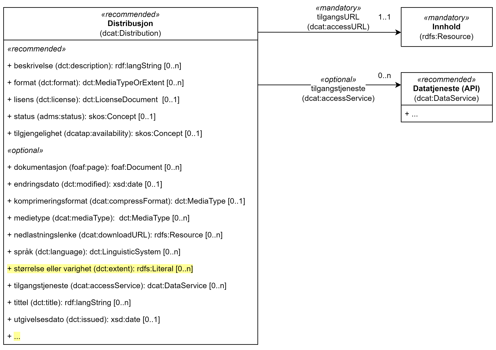

== Klassen Distribusjon (dcat:Distribution) [[Distribution]]

[[img-klassenDistribusjon]]
.Klassen Distribusjon (dcat:Distribution) og klassene den refererer til. 
[link=images/cdvno-distribution.png]

<> viser klassen Distribusjon (`dcat:Distribution`) og klassene den refererer til. Det som er #gulet# ut, er avvik fra https://data.norge.no/specification/dcat-ap-no#Distribusjon[klassen Distribusjon (dcat:Distribution) spesifisert i DCAT-AP-NO &#x29C9;, window="_blank", role="ext-link"]. Klassene som ikke er eksplisitt spesifisert i denne spesifikasjonen er ikke tatt med i figuren over eller i teksten under, f.eks. klassen Begrep (`skos:Concept`). 

[cols="30s,70d"]
|===
| _English name_ | _Distribution_
| Anvendelse / _Usage note_ | Klassen brukes til å representere en distribusjon av en nettressurs.

_The class is used to represent a distribution of an online resource._
| URI | dcat:Distribution
| Kravnivå / _Requirement level_ | Anbefalt / _Recommended_
| Merknad / _Note_ | I tillegg til egenskapene spesifisert her, kan egenskapene til https://data.norge.no/specification/dcat-ap-no#Distribusjon[klassen Distribusjon (dcat:Distribution) spesifisert i DCAT-AP-NO &#x29C9;, window="_blank", role="ext-link"] også brukes. 

__In addition to the properties that are specified here, the properties in https://data.norge.no/specification/dcat-ap-no#Distribusjon[the class Distribution (dcat:Distribution) specified in DCAT-AP-NO &#x29C9;, window="_blank", role="ext-link"] (in Norwegian) may also be used.__
|===

Eksempel i RDF Turtle:
-----
<aDistr> a dcat:Distribution; # distribusjon
   .
-----

=== Obligatoriske egenskaper for _Distribusjon_ [[Distribusjon-obligatoriske-egenskaper]]

==== Distribusjon - tilgangsURL (dcat:accessURL) [[Distribusjon-tilgangsURL]]

[cols="30s,70d"]
|===
| _English name_ | _access URL_
| URI | 	dcat:accessURL
| Verdiområde / _Range_ | rdfs:Resource
| Anvendelse / _Usage note_ | En URL som gir tilgang til en distribusjon av datasettet. Ressursen det pekes til kan gi informasjon om hvordan en kan få tilgang til datasettet.

_A URL that provides access to a distribusjon of the dataset. The resource referred to may provide information about how to get access to the dataset._
| Multiplisitet / _Multiplicity_ | 1..n 
| Kravnivå / _Requirement level_ | Obligatorisk / _Mandatory_
|===

Eksempel i RDF Turtle:
-----
<aDistr> a dcat:Distribution; # distribusjon
   dcat:accessURL <>; # tilgangsURL
   .
-----

=== Anbefalte egenskaper for _Distribusjon_ [[Distribusjon-anbefalte-egenskaper]]

==== Distribusjon - beskrivelse (dct:description) [[Distribusjon-beskrivelse]]

[cols="30s,70d"]
|===
| _English name_ | _description_
| URI | 	dct:description
| Verdiområde / _Range_ | rdf:langString
| Anvendelse / _Usage note_ | Egenskapen bruks til å oppgi en fritekstbeskrivelse av distribusjonen. Egenskapen bør gjentas når beskrivelsen finnes på flere språk.

_This property is used to specify a free-text description of the distribusjon. This property should be repeated for parallel language versions of the description._
| Multiplisitet / _Multiplicity_ | 0..n 
| Kravnivå / _Requirement level_ | Anbefalt / _Recommended_
|===

Eksempel i RDF Turtle:
-----
<aDistr> a dcat:Distribution; # distribusjon
   dct:description "testdistribusjon"@nb, "test distribution"@en; # beskrivelse
   .
-----

==== Distribusjon - format (dct:format) [[Distribusjon-format]]

[cols="30s,70d"]
|===
| _English name_ | _format_
| URI | 	dct:format
| Verdiområde / _Range_ | dct:MediaTypeOrExtent
| Anvendelse / _Usage note_ | Egenskapen bruks til å oppgi distribusjonens format. Egenskapen kan gjentas for API-er og sluttbrukerapplikasjoner som leverer data i flere formater.

_This property is used to specify the format of the distribution. This property may be repeated APIs and end user applications which provide data i several formats._
| Multiplisitet / _Multiplicity_ | 0..n 
| Kravnivå / _Requirement level_ | Anbefalt / _Recommended_
| Merknad / _Note_ | Verdien skal velges fra EUs kontrollerte vokabular https://op.europa.eu/en/web/eu-vocabularies/concept-scheme/-/resource?uri=http://publications.europa.eu/resource/authority/file-type[File type &#x29C9;, window="_blank", role="ext-link"].

__The value shall be chosen from EU's controlled vocabulary https://op.europa.eu/en/web/eu-vocabularies/concept-scheme/-/resource?uri=http://publications.europa.eu/resource/authority/file-type[File type &#x29C9;, window="_blank", role="ext-link"].__
|===

Eksempel i RDF Turtle:
-----
<aDistr> a dcat:Distribution; # distribusjon
   dct:format <http://publications.europa.eu/resource/authority/file-type/HTML>; # format, HTML
   .
-----

==== Distribusjon - lisens (dct:license) [[Distribusjon-lisens]]

[cols="30s,70d"]
|===
| _English name_ | _licence_
| URI | dct:license
| Verdiområde  / _Range_ | dct:LicenseDocument
| Anvendelse / _Usage note_ | Egenskapen brukes til å oppgi lisensen som distribusjonen er gjort tilgjengelig under.

_This property is used to specify the licence under which the distribution is made available._
| Multiplisitet / _Multiplicity_ | 0..1
| Kravnivå / _Requirement level_ | Anbefalt / _Recommended_
| Merknad / _Note_ | Verdien skal velges fra EUs kontrollerte vokabular https://op.europa.eu/en/web/eu-vocabularies/concept-scheme/-/resource?uri=http://publications.europa.eu/resource/authority/licence[Licence &#x29C9;, window="_blank", role="ext-link"].

__The value shall be chosen from EU's controlled vocabulary https://op.europa.eu/en/web/eu-vocabularies/concept-scheme/-/resource?uri=http://publications.europa.eu/resource/authority/licence[Licence &#x29C9;, window="_blank", role="ext-link"].__
|===

Eksempel i RDF Turtle:
-----
<aDistr> a dcat:Distribution; # distribusjon
   dct:license <http://publications.europa.eu/resource/authority/licence/CC0>; # lisens, CC0
   .
-----

==== Distribusjon - status (adms:status) [[Distribusjon-status]]  

[cols="30s,70d"]
|===
| _English name_ | _status_
| URI | adms:status
| Verdiområde / _Range_ | skos:Concept 
| Anvendelse / _Usage note_ | Egenskapen brukes til å angi distribusjonens modenhet.

_This property is used to specify the status of the distribution in the context of maturity lifecycle._
| Multiplisitet / _Multiplicity_ | 0..1
| Kravnivå / _Requirement level_ | Anbefalt / _Recommended_
| Merknad / _Note_ | Verdien skal velges fra EUs kontrollerte vokabular https://op.europa.eu/en/web/eu-vocabularies/concept-scheme/-/resource?uri=http://publications.europa.eu/resource/authority/dataset-status[Dataset status &#x29C9;, window="_blank", role="ext-link"].

__The value shall be chosen from EU's controlled vocabulary https://op.europa.eu/en/web/eu-vocabularies/concept-scheme/-/resource?uri=http://publications.europa.eu/resource/authority/dataset-status[Dataset status &#x29C9;, window="_blank", role="ext-link"].__
|===

Eksempel i RDF Turtle:
-----
<aBlock> a cdvno:Block; # blokk
   adms:status <http://publications.europa.eu/resource/authority/dataset-status/COMPLETED>; # status, ferdigstilt
   .
-----

==== Distribusjon - tilgjengelighet (dcatap:availability) [[Distribusjon-tilgjengelighet]]

[cols="30s,70d"]
|===
| _English name_ | _availability_
| URI | dcatap:availability
| Verdiområde / _Range_ | skos:Concept
| Anvendelse / _Usage note_ | Egenskapen brukes til å angi hvor lenge det er planlagt å holde distribusjonen av datasettet tilgjengelig.

_This property is used to indicate how long it is planned to keep the distribution of the Dataset available._
| Multiplisitet / _Multiplicity_ | 0..1 
| Kravnivå / _Requirement level_ | Anbefalt / _Recommended_
| Merknad / _Note_ | Verdien skal velges fra EUs kontrollerte vokabular https://op.europa.eu/en/web/eu-vocabularies/concept-scheme/-/resource?uri=http://publications.europa.eu/resource/authority/planned-availability[Planned availability &#x29C9;, window="_blank", role="ext-link"].

__The value shall be chosen from EU's controlled vocabulary https://op.europa.eu/en/web/eu-vocabularies/concept-scheme/-/resource?uri=http://publications.europa.eu/resource/authority/planned-availability[Planned availability &#x29C9;, window="_blank", role="ext-link"].__
|===

Eksempel i RDF Turtle:
-----
<aDistr> a dcat:Distribution; # distribusjon
   dcatap:availability <http://publications.europa.eu/resource/authority/planned-availability/AVAILABLE>; # tilgjengelighet, tilgjengelig
   .
-----

=== Valgfrie egenskaper for _Distribusjon_ [[Distribusjon-valgfrie-egenskaper]]

==== Distribusjon - dokumentasjon (foaf:page) [[Distribusjon-dokumentasjon]]

[cols="30s,70d"]
|===
| _English name_ | _page (documentation)_
| URI | foaf:page
| Verdiområde / _Range_ | foaf:Document
| Anvendelse / _Usage note_ | Egenskapen brukes til å referere til en side eller et dokument som beskriver distribusjonen.

_This property ise used to refer to a page or document about this distribution._
| Multiplisitet / _Multiplicity_ | 0..n
| Kravnivå / _Requirement level_ | Valgfri / _Optional_
|===

Eksempel i RDF Turtle:
-----
<aDistr> a dcat:Distribution; # distribusjon
   foaf:page <https://example.org/aDistrDoc>; # dokumentasjon
   .
-----

==== Distribusjon - endringsdato (dct:modified) [[Distribusjon-endringsdato]]

[cols="30s,70d"]
|===
| _English name_ | _modified (last update)_
| URI | dct:modified
| Verdiområde / _Range_ | xsd:date
| Anvendelse / _Usage note_ | Egenskapen brukes til å oppgi datoen når distribusjonen sist ble endret.

_This property is used to specify the date when the distribution was last changed._
| Multiplisitet / _Multiplicity_ | 0..1
| Kravnivå / _Requirement level_ | Valgfri / _Optional_
|===

Eksempel i RDF Turtle:
-----
<aDistr> a dcat:Distribution; # distribusjon
   dct:modified "2023-05-10"^^xsd:date; # dato sist endret
   .
-----

==== Distribusjon - komprimeringsformat (dcat:compressFormat) [[Distribusjon-komprimeringsformat]]
[cols="30s,70d"]
|===
| _English name_ | _compression format_
| URI | dcat:compressFormat
| Verdiområde / _Range_ | dct:MediaType
| Anvendelse / _Usage note_ | Egenskapen brukes til å oppgi komprimeringsformatet for distribusjonen som dataene er i dersom de er i en komprimert form, f.eks. for å redusere størrelsen på den nedlastbare filen.

_This property is used to refer to the format of the file in which the data is contained in a compressed form, e.g. to reduce the size of the downloadable file._
| Multiplisitet / _Multiplicity_ | 0..1
| Kravnivå / _Requirement level_ | Valgfri / _Optional_
| Merknad / _Note_ | Verdien bør velges fra https://www.iana.org/assignments/media-types/media-types.xhtml[IANA Media Types &#x29C9;, window="_blank", role="ext-link"]. 

__The value should be chosen from https://www.iana.org/assignments/media-types/media-types.xhtml[IANA Media Types &#x29C9;, window="_blank", role="ext-link"].__
|===

Eksempel i RDF Turtle:
-----
<aDistr> a dcat:Distribution; # distribusjon
   dcat:compressFormat <https://www.w3.org/ns/iana/media-types/application/gzip>; # komprimeringsformat, gzip
   .
-----

==== Distribusjon - medietype (dcat:mediaType) [[Distribusjon-medietype]]
[cols="30s,70d"]
|===
| _English name_ | _media type_
| URI | dcat:mediaType
| Verdiområde / _Range_ | dct:MediaType
| Anvendelse / _Usage note_ | Egenskapen brukes til å referere til medietype som distribusjonen er av.

_This property is used to refer to the media type of which the distribution is._
| Multiplisitet / _Multiplicity_ | 0..n
| Kravnivå / _Requirement level_ | Valgfri / _Optional_
| Merknad / _Note_ | Verdien skal velges fra https://www.iana.org/assignments/media-types/media-types.xhtml[IANA Media Types &#x29C9;, window="_blank", role="ext-link"]. 

__The value shall be chosen from https://www.iana.org/assignments/media-types/media-types.xhtml[IANA Media Types &#x29C9;, window="_blank", role="ext-link"].__
|===

Eksempel i RDF Turtle:
-----
<aDistr> a dcat:Distribution; # distribusjon
   dcat:mediaType <https://www.w3.org/ns/iana/media-types/application/trig>; # medietype, TriG
   .
-----

==== Distribusjon - nedlastningslenke (dcat:downloadURL) [[Distribusjon-nedlastningslenke]]

[cols="30s,70d"]
|===
| _English name_ | _download URL_
| URI | dcat:downloadURL
| Verdiområde / _Range_ | rdfs:Resource
| Anvendelse / _Usage note_ | Egenskapen brukes til å oppgi direktelenke (URL) til en nedlastbar fil i et gitt format.

_This property is used to specify a URL that is a direct link to a downloadable file in a given format._
| Multiplisitet / _Multiplicity_ | 0..n
| Kravnivå / _Requirement level_ | Valgfri / _Optional_
|===

Eksempel i RDF Turtle:
-----
<aDistr> a dcat:Distribution; # distribusjon
   dcat:downloadURL <https://example.org/aDownloadURL>; # nedlastingsURL
   .
-----

==== Distribusjon - pakkeformat (dcat:packageFormat) [[Distribusjon-pakkeformat]]
[cols="30s,70d"]
|===
| _English name_ | _packaging format_
| URI | dcat:packageFormat
| Verdiområde / _Range_ | dct:MediaType
| Anvendelse / _Usage note_ | Egenskapen brukes til å referere til formatet til filen der en eller flere datafiler er gruppert sammen, f.eks. for å gjøre det mulig å laste ned et sett relaterte filer.

_This property refers to the format of the file in which one or more data files are grouped together, e.g. to enable a set of related files to be downloaded together._
| Multiplisitet / _Multiplicity_ | 0..1
| Kravnivå / _Requirement level_ | Valgfri / _Optional_
| Merknad / _Note_ | Verdien bør velges fra https://www.iana.org/assignments/media-types/media-types.xhtml[IANA Media Types &#x29C9;, window="_blank", role="ext-link"]. 

__The value should be chosen from https://www.iana.org/assignments/media-types/media-types.xhtml[IANA Media Types &#x29C9;, window="_blank", role="ext-link"].__
|===

Eksempel i RDF Turtle:
-----
<aDistr> a dcat:Distribution; # distribusjon
   dcat:packageFormat <https://www.w3.org/ns/iana/media-types/application/zip>; # pakkeformat, zip
   .
-----

==== Distribusjon - språk (dct:language) [[Distribusjon-språk]]

[cols="30s,70d"]
|===
| _English name_ | _language_
| URI | dct:language
| Verdiområde / _Range_ | dct:LinguisticSystem
| Anvendelse / _Usage note_ | Egenskapen brukes til å oppgi språk som er brukt i distribusjonen.

_This property is used to specify the language/s that is/are used in the distribution._
| Multiplisitet / _Multiplicity_ | 0..n
| Kravnivå / _Requirement level_ | Valgfri / _Optional_
| Merknad / _Note_ | Verdien skal velges fra EUs kontrollerte vokabular https://op.europa.eu/en/web/eu-vocabularies/concept-scheme/-/resource?uri=http://publications.europa.eu/resource/authority/language[Language &#x29C9;, window="_blank", role="ext-link"].

__The value shall be chosen from EU's controlled vocabulary https://op.europa.eu/en/web/eu-vocabularies/concept-scheme/-/resource?uri=http://publications.europa.eu/resource/authority/language[Language &#x29C9;, window="_blank", role="ext-link"].__
|===

Eksempel i RDF Turtle:
-----
<aDistr> a dcat:Distribution; # distribusjon
   dct:language <http://publications.europa.eu/resource/authority/language/NOB>; # språk, bokmål
   .
-----

==== Distribusjon - størrelse eller varighet (dct:extent) [[Distribusjon-størrelse-varighet]]

[cols="30s,70d"]
|===
| _English name_ | _extent_
| URI | dct:extent
| Verdiområde / _Range_ | rdfs:Literal
| Anvendelse / _Usage note_ | Egenskapen brukes til å oppgi størrelsen eller varighet av ressursen.

_This property is used to specify the size or duration of the resource._
| Multiplisitet / _Multiplicity_ | 0..n
| Kravnivå / _Requirement level_ | Valgfri / _Optional_
|===

Eksempel i RDF Turtle:
-----
<aDistr> a dcat:Distribution; # distribusjon
   dct:extent "1 h 26 min 41 sec"; # varighet
   .
-----

==== Distribusjon - tilgangstjeneste (dcat:accessService) [[Distribusjon-tilgangstjeneste]]

[cols="30s,70d"]
|===
| _English name_ | _access service_
| URI | dcat:accessService
| Verdiområde / _Range_ | dcat:DataService
| Anvendelse / _Usage note_ | Egenskapen brukes til å referere til en datatjeneste som gir tilgang til distribusjonen.

_This property is used to refer to a data service that gives access to the distribution._
| Multiplisitet / _Multiplicity_ | 0..n
| Kravnivå / _Requirement level_ | Valgfri / _Optional_
|===

Eksempel i RDF Turtle:
-----
<aDistr> a dcat:Distribution; # distribusjon
   dcat:accessService <aDataSrvc>; # tilgangstjeneste
   .
-----

==== Distribusjon - tittel (dct:title) [[Distribusjon-tittel]]

[cols="30s,70d"]
|===
| _English name_ | _title_
| URI | dct:title
| Verdiområde / _Range_ | rdf:langString
| Anvendelse / _Usage note_ | Egenskapen brukes til å oppgi navnet på distribusjonen. Egenskapen bør gjentas når navnet finnes på flere språk. 

_This property is used to specify the title of the distribution. This property should be repeated for parallel language versions of the title._
| Multiplisitet / _Multiplicity_ | 0..n
| Kravnivå / _Requirement level_ | Valgfri / _Optional_
|===

Eksempel i RDF Turtle:
-----
<aDistr> a dcat:Distribution; # distribusjon
   dct:title "testdistribusjon"@nb, "test distribution"@en; # tittel
   .
-----

==== Distribusjon - utgivelsesdato (dct:issued) [[Distribusjon-utgivelsesdato]]

[cols="30s,70d"]
|===
| _English name_ | _issued_
| URI | dct:issued
| Verdiområde / _Range_ | xsd:date
| Anvendelse / _Usage note_ | Egenskapen brukes til å oppgi datoen for formell utgivelse/publisering av distribusjonen.

_This property is used to specify the date for the formal issuing/publication of the distribution._
| Multiplisitet / _Multiplicity_ | 0..1
| Kravnivå / _Requirement level_ | Valgfri / _Optional_
|===

Eksempel i RDF Turtle:
-----
<aDistr> a dcat:Distribution; # distribusjon
   dct:issued "2023-05-01"^^xsd:date; # utgivelsesdato
   .
-----
