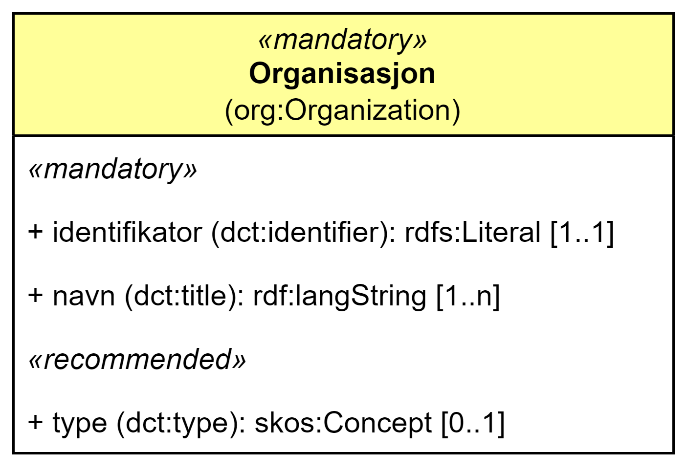

== Klassen Organisasjon (org:Organization) [[Organization]]

[[img-klassenOrganisasjon]]
.Klassen Organisasjon (org:Organization). 
[link=images/cdvno-organization.png]

<> viser klassen Organisasjon (`org:Organization`). Klassen er #gulet# ut fordi den ikke er eksplisitt spesifisert i DCAT-AP-NO, dermed et avvik fra DCAT-AP-NO. 

[cols="30s,70d"]
|===
| _English name_ | _Organization_
| Anvendelse / _Usage note_ | Klassen brukes til å representere en organisasjon.

_The class is used to represent an organization._
| URI | org:Organization
| Kravnivå / _Requirement level_ | Obligatorisk / _Mandatory_
|===

Eksempel i RDF Turtle:
-----
<anOrg> a org:Organization; # organisasjon
   .
-----

=== Obligatoriske egenskaper for _Organisasjon_ [[Organisasjon-obligatoriske-egenskaper]]

==== Organisasjon – identifikator (dct:identifier) [[Organisasjon-identifikator]]

[cols="30s,70d"]
|===
| _English name_ | _identifier_
| URI | dct:identifier
| Verdiområde / _Range_ | rdfs:Literal
| Anvendelse / _Usage note_ | Egenskapen brukes til å oppgi identifikatoren til organisasjonen.

_This property is used to specify the identifier to the organization._
| Multiplisitet / _Multiplicity_ | 1..1
| Kravnivå / _Requirement level_ | Obligatorisk / _Mandatory_
| Merknad / _Note_ | Når organisasjonen har et organisasjonsnummer registrert i Enhetsregisteret, bør identifikatoren oppgis som en URI med f.eks. følgende mønster der "nnnnnnnnn" er organisasjonsnummeret: `\https://organization-catalog.fellesdatakatalog.digdir.no/organizations/nnnnnnnnn`.

_When the organization has a organization number registered in the Central Coordinating Register for Legal Entities (CCR), the identifier should be given as a URI with e.g. the following pattern where "nnnnnnnnn" is the organization number: `\https://organization-catalog.fellesdatakatalog.digdir.no/organizations/nnnnnnnnn`._
|===

Eksempel i RDF Turtle:
-----
<anOrg> a org:Organization; # organisasjon
   dct:identifier "https://organization-catalog.fellesdatakatalog.digdir.no/organizations/991825827"^^xsd:anyURI; # identifikator
   .
-----

==== Organisasjon – navn (dct:title) [[Organisasjon-tittel]]  

[cols="30s,70d"]
|===
| _English name_ | _name_
| URI | dct:title
| Verdiområde / _Range_ | rdf:langString
| Anvendelse / _Usage note_ | Egenskapen brukes til å oppgi navnet til organisasjonen. Egenskapen bør gjentas når navnet finnes på flere språk. 

_This property is used to specify the name of the organization. This property should be repeated for parallel language versions of the name._
| Multiplisitet / _Multiplicity_ |  1..n
| Kravnivå / _Requirement level_ | Obligatorisk / _Mandatory_
|===

Eksempel i RDF Turtle:
-----
<anOrg> a org:Organization; # organisasjon
   dct:title "Digitaliseringsdirektoratet"@nb, "Norwegian Digitalisation Agency"@en; # navn
   .
-----

=== Anbefalte egenskaper for _Organisasjon_ [[Organisasjon-anbefalte-egenskaper]]

==== Organisasjon – type (dct:type) [[Organisasjon-type]] 

[cols="30s,70d"]
|===
| _English name_ | _type_
| URI | dct:type
| Verdiområde / _Range_ | skos:Concept
| Anvendelse / _Usage note_ | Egenskapen brukes til å oppgi organisasjonens type.

_This property is used to specify the type of the organization_
| Multiplisitet / _Multiplicity_ | 0..1
| Kravnivå / _Requirement level_ | Valgfri / _Optional_
| Merknad / _Note_ | Verdien bør velges fra https://raw.githubusercontent.com/SEMICeu/ADMS-AP/master/purl.org/ADMS_SKOS_v1.00.rdf[ADMS Publisher Type Vocabulary &#x29C9;, window="_blank", role="ext-link"] (lenket ressurs i RDF) .

__The value should be chosen from https://raw.githubusercontent.com/SEMICeu/ADMS-AP/master/purl.org/ADMS_SKOS_v1.00.rdf[ADMS Publisher Type Vocabulary &#x29C9;, window="_blank", role="ext-link"] (linked resource in RDF).__
|===

Eksempel i RDF Turtle:
-----
<anOrg> a org:Organization; # organisasjon
   dct:type <http://purl.org/adms/publishertype/NationalAuthority>; # type, nasjonal myndighet
   .
-----