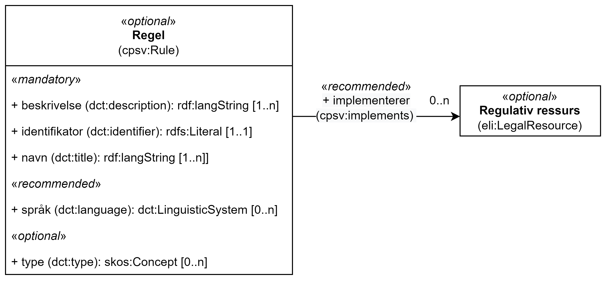

== Klassen Regel (cpsv:Rule) [[Regel]]

[[img-KlassenRegel]]
.Klassen Regel (cv:Rule) og klassen den refererer til.
[link=images/cdvno-rule.png]

[cols="30s,70d"]
|===
| _English name_ | _Rule_
| Anvendelse / _Usage note_ | Klassen brukes til å representere regler/dokumenter som setter spesifikke regler, retningslinjer eller prosedyrer som skal følges av blokkens innhold.

_This class is used to represent a document that sets out the specific rules, guidelines or procedures that the content of the block follows. It includes the terms of service, licence, and authentication requirements of the Service._
| URI |cpsv:Rule
| Kravnivå / _Requirement level_ | Valgfri / _Optional_
|===

Eksempel i RDF Turtle: 

-----
<aRule> a cpsv:Rule; # regel
   . 
-----

=== Obligatoriske egenskaper for klassen _Regel_ [[Regel-obligatoriske-egenskaper]]

==== Regel - beskrivelse (dct:description) [[Regel-beskrivelse]]

[cols="30s,70d"]
|===
| _English name_ | _description_
| URI | dct:description
| Verdiområde / _Range_ | rdf:langString
| Anvendelse / _Usage note_ | Egenskapen brukes til å oppgi en tekstlig beskrivelse av regelen. Egenskapen bør gjentas når beskrivelsen finnes på flere språk.

_This property contains descriptive textual information about the rule. This property should be repeated for parallel language versions of the text in different languages._
|  Multiplisitet / _Multiplicity_  / _Multiplicity_ |1..n
| Kravnivå / _Requirement level_ | Obligatorisk / _Mandatory_
|===

Eksempel i RDF Turtle: 

-----
<aRule> a cpsv:Rule; # regel
   dct:description "bare for testing"@nb, "for test only"@en; # beskrivelse
   . 
-----

==== Regel - identifikator (dct:identifier) [[Regel-identifikator]]

[cols="30s,70d"]
|===
| _English name_ | _identifier_
| URI |dct:identifier
| Verdiområde / _Range_ |rdfs:Literal
| Anvendelse / _Usage note_ | Egenskapen brukes til å oppgi identifikatoren til regelen.

_This property contains an identifier for the rule._
|  Multiplisitet / _Multiplicity_  / _Multiplicity_ |1..1
| Kravnivå / _Requirement level_ | Obligatorisk / _Mandatory_
| Merknad / _Note_ |Identifikator er som regel systemgenerert av verktøystøtte, slik at du som vanlig bruker ikke trenger å fylle ut verdien til egenskapen manuelt. For deg som skal utvikle/tilpasse verktøystøtte, se https://data.norge.no/guide/veileder-beskrivelse-av-datasett/#om-identifikator[Om identifikator (dct:identifier) i Veileder for beskrivelse av datasett osv. &#x29C9;, window="_blank", role="ext-link"]

__See https://data.norge.no/guide/veileder-beskrivelse-av-datasett#om-identifikator[Om identifikator (dct:identifier) i Veileder for beskrivelse av datasett osv. &#x29C9;, window="_blank", role="ext-link"] (in Norwegian).__
|===

Eksempel i RDF Turtle: 

-----
<aRule> a cpsv:Rule; # regel
   dct:identifier "https://example.org/anId"^^xsd:anyURI; # identifikator
   . 
-----

==== Regel - navn (dct:title) [[Regel-navn]]

[cols="30s,70d"]
|===
| _English name_ | _name_
| URI |dct:title
| Verdiområde / _Range_ | rdf:langString
| Anvendelse / _Usage note_ | Egenskapen brukes til å oppgi et beskrivende navn eller tittel for regelen. Egenskapen bør gjentas når navnet finnes på flere språk.

_This property refers to the descriptive title or name of a Resource. This property should be repeated for parallel language versions of the name in different languages._
|  Multiplisitet / _Multiplicity_  / _Multiplicity_ |1..n
| Kravnivå / _Requirement level_ | Obligatorisk / _Mandatory_
|===

Eksempel i RDF Turtle: 

-----
<aRule> a cpsv:Rule; # regel
   dct:title "testregel"@nb, "test rule"@en; # navn
   . 
-----

=== Anbefalte egenskaper for klassen _Regel_ [[Regel-anbefalte-egenskaper]]

==== Regel - implementerer (cpsv:implements) [[Regel-implementerer]]

[cols="30s,70d"]
|===
| _English name_ | _implements_
| URI |cpsv:implements
| Verdiområde / _Range_ |eli:LegalResource
| Anvendelse / _Usage note_ | Egenskapen brukes til å referere til en regulativ ressurs som regelen er definert inn under.

_This property links a rule to relevant legislation or policy documents, such as the legal resource under which the rules are defined._
|  Multiplisitet / _Multiplicity_  / _Multiplicity_ |0..n
| Kravnivå / _Requirement level_ | Anbefalt / _Recommended_
|===

Eksempel i RDF Turtle: 

-----
<aRule> a cpsv:Rule; # regel
   cpsv:implements <aLegalResource>; # implementerer
   . 
-----

==== Regel - språk (dct:language) [[Regel-språk]]

[cols="30s,70d"]
|===
| _English name_ | _language_
| URI | dct:language
| Verdiområde / _Range_ |dct:LinguisticSystem
| Anvendelse / _Usage note_ | Egenskapen brukes til å oppgi hvilke språk regelen er tilgjengelig på.

_This property represents the language(s) in which the rule is available. This could be one or multiple languages, for instance in countries with more than one official language._
|  Multiplisitet / _Multiplicity_  / _Multiplicity_ |0..n
| Kravnivå / _Requirement level_ | Anbefalt / _Recommended_
|Merknad / _Note_ |Verdien skal velges fra EUs kontrollerte vokabular https://op.europa.eu/en/web/eu-vocabularies/concept-scheme/-/resource?uri=http://publications.europa.eu/resource/authority/language[Language &#x29C9;, window="_blank", role="ext-link"].

__The value shall be chosen from EU's controlled vocabulary https://op.europa.eu/en/web/eu-vocabularies/concept-scheme/-/resource?uri=http://publications.europa.eu/resource/authority/language[Language &#x29C9;, window="_blank", role="ext-link"].__
|===

Eksempel i RDF Turtle: 

-----
<aRule> a cpsv:Rule; # regel
   dct:language <http://publications.europa.eu/resource/authority/language/NOB>; # språk, bokmål
   . 
-----

=== Valgfrie egenskaper for klassen _Regel_ [[Regel-valgfrie-egenskaper]]

==== Regel - type (dct:type) [[Regel-type]]

[cols="30s,70d"]
|===
| _English name_ | _type_
| URI | dct:type
| Verdiområde / _Range_ |skos:Concept
| Anvendelse / _Usage note_ | Egenskapen brukes til å spesifisere type regel. 

_This property refers to the type of a Rule._
|  Multiplisitet / _Multiplicity_  / _Multiplicity_ |0..n
| Kravnivå / _Requirement level_ | Valgfri / _Optional_
|Merknad / _Note_ |Verdien bør velges fra det felles kontrollerte vokabularet https://data.norge.no/vocabulary/rule-type[Regeltype &#x29C9;, window="_blank", role="ext-link"], når verdien finnes i vokabularet.

__The value should be chosen from the common controlled vocabulary https://data.norge.no/vocabulary/rule-type[Rule type &#x29C9;, window="_blank", role="ext-link"], when the value is in the vocabulary.__
|===

Eksempel i RDF Turtle: 

-----
<aRule> a cpsv:Rule; # regel
   dct:type <https://data.norge.no/vocabulary/rule-type#case-management-rules>; # type, saksbehandlingsregel
   . 
-----
