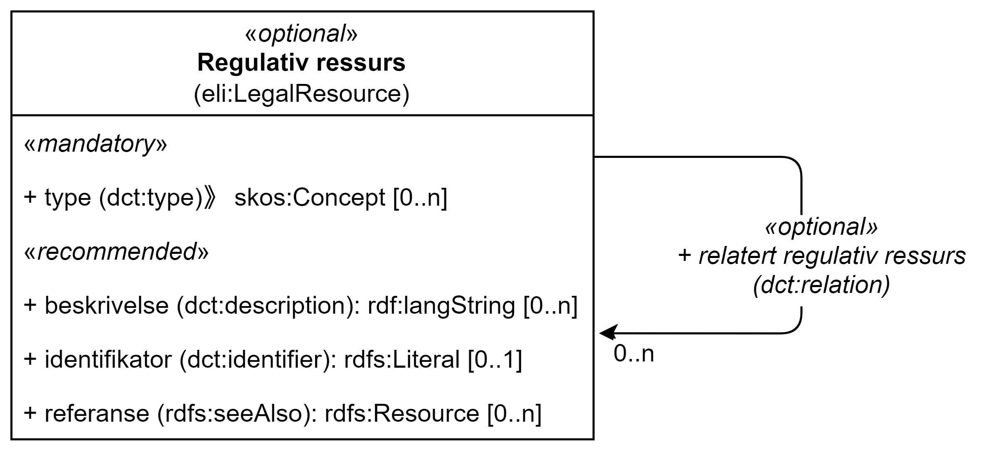

== Klassen Regulativ ressurs (eli:LegalResource) [[RegulativRessurs]]

[[img-KlassenRegulativRessurs]]
.Klassen Regulativ ressurs (eli:LegealResource).
[link=images/cdvno-legal-resource.png]

[cols="30s,70d"]
|===
| _English name_ | _Legal Resource_
| Anvendelse / _Usage note_ | Klassen brukes til å representere en regulativ ressurs, f.eks. lovgivning/lovverket, retningslinjer eller politikk som regulerer utførelsen av en tjeneste.

_This class is used to represent the legislation, policy or policies that lie behind the Rules that govern the service._
| URI | eli:LegalResource
| Kravnivå / _Requirement level_ | Valgfri / _Optional_
|===

Eksempel i RDF Turtle: 

-----
<aLegalResource> a eli:LegalResource; # regulativ ressurs
   . 
-----

=== Obligatoriske egenskaper for klassen _Regulativ ressurs_ [[RegulativRessurs-obligatoriske-egenskaper]]

==== Regulativ ressurs - type (dct:type) [[RegulativRessurs-type]]

[cols="30s,70d"]
|===
| _English name_ | _type_
| URI | dct:type
| Verdiområde / _Range_ | eli:ResourceType
| Anvendelse / _Usage note_ | Egenskapen brukes til å referere til typen av en regulativ ressurs (f.eks. direktiv, forordning).

_This property refers to the type of a legal resource (e.g. "Directive", "Règlement grand ducal", "law", "Règlement ministériel", "draft proposition", "Parliamentary act" etc.)._
| Multiplisitet / _Multiplicity_ | 1..n
| Kravnivå / _Requirement level_ | Obligatorisk / _Mandatory_
|Merknad / _Note_ | Verdien skal velges fra det felles kontrollerte vokabularet https://data.norge.no/vocabulary/legal-resource-type[Regulativ ressurs type &#x29C9;, window="_blank", role="ext-link"], når verdien finnes i vokabularet.

__The value shall be chosen from the common controlled vocabulary https://data.norge.no/vocabulary/legal-resource-type[Legal resource type &#x29C9;, window="_blank", role="ext-link"], when the value is in the vocabulary.__
|===

Eksempel i RDF Turtle: 

-----
<aLegalResource> a eli:LegalResource; # regulativ ressurs
   dct:type <https://data.norge.no/vocabulary/legal-resource-type#regulation>; # type, forskrift
   . 
-----

=== Anbefalte egenskaper for klassen _Regulativ ressurs_ [[RegulativRessurs-anbefalte-egenskaper]]

==== Regulativ ressurs - beskrivelse (dct:description) [[RegulativRessurs-beskrivelse]]

[cols="30s,70d"]
|===
| _English name_ | _description_
| URI | dct:description
| Verdiområde / _Range_ | rdf:langString
| Anvendelse / _Usage note_ | Egenskapen brukes til å referere til en tekstlig beskrivelse av ressursen. Egenskapen bør gjentas når den finnes på flere språk.

_This property contains descriptive textual information about the Legal Resource. This property should be repeated for parallel language versions of the text in different languages._
| Multiplisitet / _Multiplicity_ | 0..n
| Kravnivå / _Requirement level_ | Anbefalt / _Recommended_
|===

Eksempel i RDF Turtle: 

-----
<aLegalResource> a eli:LegalResource; # regulativ ressurs
   dct:description "bare for testing"@nb, "for test only"@en; # beskrivelse
   . 
-----

==== Regulativ ressurs - identifikator (dct:identifier) [[RegulativRessurs-identifikator]]

[cols="30s,70d"]
|===
| _English name_ | _identifier_
| URI | dct:identifier
| Verdiområde / _Range_ |rdfs:Literal
| Anvendelse / _Usage note_ | Egenskapen brukes til å oppgi en identifikator til ressursen.

_This property contains an identifier for the resource._
| Multiplisitet / _Multiplicity_ |0..1
| Kravnivå / _Requirement level_ | Anbefalt / _Recommended_
| Merknad / _Note_ |Identifikator er som regel systemgenerert av verktøystøtte, slik at du som vanlig bruker ikke trenger å fylle ut verdien til egenskapen manuelt. For deg som skal utvikle/tilpasse verktøystøtte, se https://data.norge.no/guide/veileder-beskrivelse-av-datasett/#om-identifikator[Om identifikator (dct:identifier) i Veileder for beskrivelse av datasett osv. &#x29C9;, window="_blank", role="ext-link"]

__See https://data.norge.no/guide/veileder-beskrivelse-av-datasett#om-identifikator[Om identifikator (dct:identifier) i Veileder for beskrivelse av datasett osv. &#x29C9;, window="_blank", role="ext-link"] (in Norwegian).__
|===

Eksempel i RDF Turtle: 

-----
<aLegalResource> a eli:LegalResource; # regulativ ressurs
   dct:identifier "https://example.org/anId"^^xsd:anyURI; # identifikator
   . 
-----

==== Regulativ ressurs - referanse (rdfs:seeAlso) [[RegulativRessurs-referanse]]

[cols="30s,70d"]
|===
| _English name_ | _reference_
| URI | rdfs:seeAlso
| Verdiområde / _Range_ | rdfs:Resource
| Anvendelse / _Usage note_ | Egenskapen brukes til å oppgi referanse til den regulative ressursen.

_This property is used to specify the reference(s) to the legal resource._
| Multiplisitet / _Multiplicity_ |0..n
| Kravnivå / _Requirement level_ | Anbefalt / _Recommended_
|===

Eksempel i RDF Turtle: 

-----
<aLegalResource> a eli:LegalResource; # regulativ ressurs
   rdfs:seeAlso <https://example.org/aRef>; # referanse
   . 
-----

==== Regulativ ressurs - språk (dct:language) [[RegulativRessurs-språk]]

[cols="30s,70d"]
|===
| _English name_ |  _language_
| URI | dct:language
| Verdiområde / _Range_ | dct:LinguisticSystem
| Anvendelse / _Usage note_ | Egenskapen brukes til å oppgi språk som den regulative ressursen er  tilgjengelig på.

_To specify the language in which the legal resource is available._
| Multiplisitet / _Multiplicity_ |0..n
| Kravnivå / _Requirement level_ | Anbefalt / _Recommended_
|Merknad / _Note_ |Verdien skal velges fra EUs kontrollerte vokabular https://op.europa.eu/en/web/eu-vocabularies/concept-scheme/-/resource?uri=http://publications.europa.eu/resource/authority/language[Language &#x29C9;, window="_blank", role="ext-link"].

__The value shall be chosen from Eu's controlled vocabulary https://op.europa.eu/en/web/eu-vocabularies/concept-scheme/-/resource?uri=http://publications.europa.eu/resource/authority/language[Language &#x29C9;, window="_blank", role="ext-link"].__
|===

Eksempel i RDF Turtle: 

-----
<aLegalResource> a eli:LegalResource; # regulativ ressurs
   dct:language <http://publications.europa.eu/resource/authority/language/NOB>; # språk, bokmål
   . 
-----

==== Regulativ ressurs - tittel (dct:title) [[RegulativRessurs-tittel]]

[cols="30s,70d"]
|===
| _English name_ |  title
| URI | dct:title
| Verdiområde / _Range_ | rdf:langString
| Anvendelse / _Usage note_ | Egenskapen brukes til å oppgi tittel til den regulative ressursen. Egenskapen bør gjentas bør tittelen finnes på flere språk.

_To specify the title of the legal resource, repeated when the title is in several parallel languages._
| Multiplisitet / _Multiplicity_ |0..n
| Kravnivå / _Requirement level_ | Anbefalt / _Recommended_
|===

Eksempel i RDF Turtle: 

-----
<aLegalResource> a eli:LegalResource; # regulativ ressurs
   dct:title "test regulativ ressurs"@nb, "test legal resource"@en; # tittel
   . 
-----

=== Valgfrie egenskaper for klassen _Regulativ ressurs_ [[RegulativRessurs-valgfrie-egenskaper]]

==== Regulativ ressurs - relatert regulativ ressurs (dct:relation) [[RegulativRessurs-relatertRegulativRessurs]]

[cols="30s,70d"]
|===
| _English name_ | related legal resource
| URI | dct:relation
| Verdiområde / _Range_ |eli:LegalResource
| Anvendelse / _Usage note_ | Egenskapen brukes til å referere til en annen relatert regulativ ressurs.

_This property represents another instance of the Legal Resource class that is related to a particular Legal Resource being described._
| Multiplisitet / _Multiplicity_ |0..n
| Kravnivå / _Requirement level_ | Valgfri / _Optional_
|===

Eksempel i RDF Turtle: 

-----
<aLegalResource> a eli:LegalResource; # regulativ ressurs
   dct:relation <anotherLegalResource> # relatert regulativ ressurs
   . 
-----

