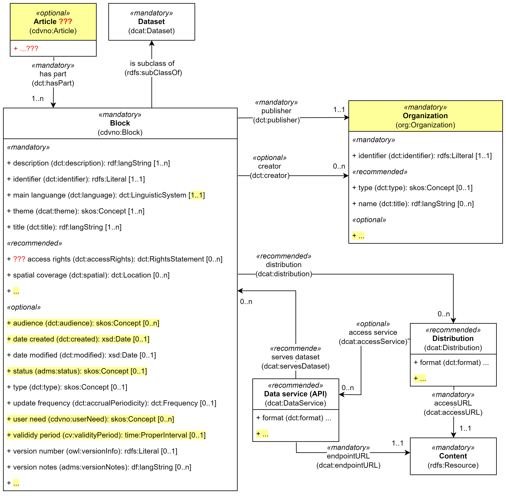

include::../locale/attributes.adoc[]
= Velkommen til sandkassa for CDV-NO!
:doctype: article
:docinfo: shared
:docinfodir: ../overview
:icons: font
:toc: left
:toclevels: 4
// :sectlinks:
:sectanchors:
:table-stripes: even
:xrefstyle: short

NOTE: *Innmelding av feil og mangler:* + 
Vennligst meld dine tilbakemeldinger inn som https://github.com/jimjyang/playground/issues[Github Issues ↗, window="_blank", role="ext-link"]. Dersom du ikke allerede har bruker på Github kan du opprette bruker gratis. 

Det som utformes/utprøves i denne sandkassa er: Forslag til metadatamodell i "Spesifikasjon for innholdsbeskrivelse" (arbeidstittel), forkortet til CDV-NO (Content Description Vocabulary - Norwegian specification).   

== Metadatamodell for innholdsbeskrivelse (arbeidstittel)

.Forslag til metadatamodellen
[link=images/content-description-vocabulary-no.png]

Figuren ovenfor inneholder et forslag til "metadatamodellen". 

Forslaget gjenbruker https://data.norge.no/specification/dcat-ap-no["Standard for beskrivelse av datasett, datatjenester og datakataloger (DCAT-AP-NO) ↗", window="_blank", role="ext-link"]. Det som er #gulet# ut i tegningen, er avvik fra DCAT-AP-NO.  

Kort forklaring til metadatamodellen: 

* Obligatorisk (mandatory) betyr "skal alltid tas med"; anbefalt (recommended) betyr "bør tas med hvis finnes" og valgfri (optional) betyr "kan tas med". 
* Innholdet som skal "tagges" (= beskrives med metadata) er en instans av klassen "Content (`rdfs:Recource`)".
* Innholdet kan nås via en instans av klassen "Distribution (`dcat:Distribution`)" eller en instans av klassen "Data service (API) (`dcat:DataService`)".
* Innholdet beskrives ("tagges") med egenskapene i klassen "Block (`cdvno:Block`)".
** Klassen "Block (`cdvno:Block`)" er en subklasse av klassen "Dataset description (`dcat:Dataset`)" fra ovennevnte DCAT-AP-NO. 
* #_Mer utdypende forklaring kan komme senere hvis trengs_#

#_Klassene og egenskapene skal senere spesifiseres, slik at det hele blir en spesifikasjon for innholdsbeskrivelse._#

== Et tenkt eksempel

Som et konkret demo-/test-eksempel, la oss si at vi ønsker å tagge https://www.helsenorge.no/hjelpetilbud-i-kommunene/avlastningstiltak/#klage-pa-vedtak["\"Klage på vedtak\" ↗", window="_blank", role="ext-link"] under "Støtte og avlastning til pårørende med store omsorgsoppgaver" på helse.norge.no: 

* Her er link:files/test-nb.html[HTML-visning] av en demo-instans av klassen "Block (`cdvno:Block`)" med distribusjon. 
* Her er link:files/test.ttl[RDF Turtle-representasjon] av demo-instansen og dens distribusjon.  

== Egenskaper med "kodet verdi" (dvs. behov for taksonomier)

Tabellen under viser egenskapene som bør ha "kodet verdi", med mulige kandidater til taksonomier (også kalt "kontrollerte vokabularer"). 

[cols="20s,40d, 40d"]
|===
| egenskap | *eksempler* | *mulige taksonomier*
3+| _klassen Block (cdvno:Block)_
| access rights (dct:accessRights) | Public, Restricted, ... | EUs https://op.europa.eu/en/web/eu-vocabularies/concept-scheme/-/resource?uri=http://publications.europa.eu/resource/authority/access-right[Access right ↗, window="_blank", role="ext-link"]
| audience (dct:audience) | tjenestetilbyder, tjenestemottaker, pårørende, ... | 
| main language (dct:language) | bokmål, nynorsk, ... | EUs https://op.europa.eu/en/web/eu-vocabularies/concept-scheme/-/resource?uri=http://publications.europa.eu/resource/authority/language[Language ↗, window="_blank", role="ext-link"]
| spatial coverage (dct:spatial) | Norge, HSØ, Viken, Oslo, Gamle byen, ... | EUs https://op.europa.eu/en/web/eu-vocabularies/concept-scheme/-/resource?uri=http://publications.europa.eu/resource/authority/country[Country ↗, window="_blank", role="ext-link"]; Kartverkets Administrative enheter; ...
| status (adms:status) |  | EUs https://op.europa.eu/en/web/eu-vocabularies/concept-scheme/-/resource?uri=http://publications.europa.eu/resource/authority/dataset-status[Dataset status ↗, window="_blank", role="ext-link"]
| theme (dcat:theme) | helse, ... | EUs https://op.europa.eu/en/web/eu-vocabularies/concept-scheme/-/resource?uri=http://publications.europa.eu/resource/authority/data-theme[Data theme ↗, window="_blank", role="ext-link"]; Norsk https://psi.norge.no/los/struktur.html[Los ↗, window="_blank", role="ext-link"]; Sektorspesifikke taksonomier
| type (dct:type) | (om) rettigheter, ... | 
| update frequency (dct:accrualPeriodicity) | årlig, hvert tredje år, ... | EUs https://op.europa.eu/en/web/eu-vocabularies/concept-scheme/-/resource?uri=http://publications.europa.eu/resource/authority/frequency[Frequency ↗, window="_blank", role="ext-link"]
| user need (cvdno:userNeed) | | 
3+| _klassen Distribution (dcat:Distribution)_
| compression format (dcat:compressFormat) | gzip, ... | https://www.iana.org/assignments/media-types/media-types.xhtml[IANA Media Types ↗, window="_blank", role="ext-link"]
| format (dct:format) | text, png, mp4, html, ... | EUs https://op.europa.eu/en/web/eu-vocabularies/concept-scheme/-/resource?uri=http://publications.europa.eu/resource/authority/file-type[File type ↗, window="_blank", role="ext-link"]
| licence (dct:license) | CC0, CCBY4, ... | EUs https://op.europa.eu/en/web/eu-vocabularies/concept-scheme/-/resource?uri=http://publications.europa.eu/resource/authority/licence[Licence ↗, window="_blank", role="ext-link"]
| media type (dcat:mediaType) | mp4, ... | https://www.iana.org/assignments/media-types/media-types.xhtml[IANA Media Types ↗, window="_blank", role="ext-link"]
| packaging format (dcat:packageFormat) | TAR, ... | https://www.iana.org/assignments/media-types/media-types.xhtml[IANA Media Types ↗, window="_blank", role="ext-link"]
| status (adms:status) |  | EUs https://op.europa.eu/en/web/eu-vocabularies/concept-scheme/-/resource?uri=http://publications.europa.eu/resource/authority/dataset-status[Dataset status ↗, window="_blank", role="ext-link"]
| ... | ... | ...
3+| _klassen Data service (dcat:DataService)_ 
| access rights (dct:accessRights) | Public, Restricted, ... | EUs https://op.europa.eu/en/web/eu-vocabularies/concept-scheme/-/resource?uri=http://publications.europa.eu/resource/authority/access-right[Access right ↗, window="_blank", role="ext-link"]
| format (dct:format) | text, png, mp4, html, ... | EUs https://op.europa.eu/en/web/eu-vocabularies/concept-scheme/-/resource?uri=http://publications.europa.eu/resource/authority/file-type[File type ↗, window="_blank", role="ext-link"]
| licence (dct:license) | CC0, CCBY4, ... | EUs https://op.europa.eu/en/web/eu-vocabularies/concept-scheme/-/resource?uri=http://publications.europa.eu/resource/authority/licence[Licence ↗, window="_blank", role="ext-link"]
| media type (dcat:mediaType) | mp4, ... | https://www.iana.org/assignments/media-types/media-types.xhtml[IANA Media Types ↗, window="_blank", role="ext-link"]
| ... | ... | ...
|===
