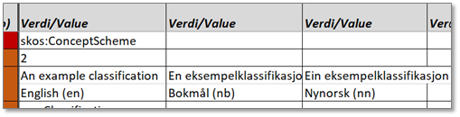

include::../locale/attributes.adoc[]
= Enkel brukerveiledning for verktøyet «(Digdir) Excel2Turtle/Html»
:doctype: article
:docinfo: shared
:docinfodir: ../overview
:icons: font
:toc: left
:toclevels: 4
// :sectlinks:
:sectanchors:
:table-stripes: even
:xrefstyle: short
:sectnums:
:sectnumlevels: 5

NOTE: *Innmelding av feil og mangler:* + 
Vennligst meld dine tilbakemeldinger inn som https://github.com/jimjyang/playground/issues[Github Issues ↗, window="_blank", role="ext-link"]. Dersom du ikke allerede har bruker på Github kan du opprette bruker gratis. 

== Innledning
Verktøyet kan brukes til å generere RDF Turtle og HTML, automatisk. Det er ikke lagt vekt på å få til et robust verktøy, slik at verktøyet fungerer kun ved «normal» bruk. I denne veiledningen forsøkes derfor å beskrive hva som er «normal» bruk. Veiledningen vil bli «løpende» oppdatert etter hvert som flere tilfeller av «unormal» bruk oppdages og/eller verktøyet forbedres. 

Verktøyet var primært laget for å kunne automatisk generere klassifikasjonsbeskrivelser i henhold til https://data.norge.no/specification/xkos-ap-no[XKOS-AP-NO ↗, window="_blank", role="ext-link"]. Det er allikevel forsøkt å lage verktøyet slik at det også kan brukes til å automatisk generere RDF Turtle (og HTML) fra en «hvilken som helst» Excel-mal som er utformet iht. visse mønstre.  

Notatet beskriver begge brukstilfeller: 

* når du (som en «vanlig» bruker) bruker en ferdig Excel-mal,
* når du (som en «tilrettelegger») skal sette opp en Excel-mal iht. en gitt spesifikasjon som f.eks. XKOS-AP-NO, CPSV-AP-NO osv.

== Når du bruker en ferdig Excel-mal

=== Obligatoriske, anbefalte og valgfrie egenskaper

Noe avhengig av hvordan malen er satt opp, men f.eks.: 

* Raden med rød farge og med «+rdf:type+» i første kolonnen: verdien i denne raden er satt opp av «tilretteleggeren» og skal ikke endres!
* [#Fra og med v.3#] Raden med rød farge og med «rdf:about» i første kolonnen: verdien i denne raden er enten satt opp av «tilretteleggeren» eller skal bestemmes av «tilretteleggeren», så snakk med vedkommende om/hvordan du skal fylle ut denne raden.  
* Radene med mørkebrun farge: egenskapene i slike rader er obligatoriske i henhold til den aktuelle spesifikasjonen som malen er satt opp for, dvs. de _skal_ inneholde verdi.
* Radene med lysebrun/oransje farge: egenskapene i slike rader er anbefalte i henhold til den aktuelle spesifikasjonen som malen er satt opp for, dvs. de _bør_ inneholde verdi.
* Radene med gul farge: egenskapene i slike rader er obligatoriske i henhold til den aktuelle spesifikasjonen som malen er satt opp for, dvs. de _kan_ inneholde verdi.
* Raden med hvit farge: egenskapene i slike rader er ikke eksplisitt spesifisert i den aktuelle spesifikasjonen som malen er satt opp for, men er tatt med av «tilretteleggeren» for at de skal kunne brukes.

[.line-through]#[Fra og med v.3 blir dette avsnittet uaktuelt] Merk at selv når egenskap identifikator (+dct:identifier+) ikke er obligatorisk, er det en fordel allikevel å oppgi verdi til denne egenskapen. Verdien brukes nemlig av verktøyet til å automatisk generere den unike identifikatoren (URIen), du vil derfor styre hvordan URIen skal se ut ved å oppgi verdien her. Når egenskapen identifikator mangler verdi, bruker verktøyet fanenavnet til å generere URIen. Spør din «tilrettelegger» hvordan du skal oppgi verdi til en identifikator.# 

=== Å oppgi verdi til en egenskap

Det er viktig at du skal oppgi verdiene fra og med den første «Verdi/Value»-kolonnen og fortsette bortover hvis det er flere verdier som skal oppgis for den aktuelle egenskapen, én verdi per celle. Det skal altså ikke være blanke celler mellom verdiene bortover i en rad, fordi verktøyet stopper å lete etter verdi når det er kommet til en blank celle.  

Hvor mange verdier som er tillatt for den enkelte egenskapen kan være oppgitt i kolonnen «Multiplisitet». 

 

=== De vanligste datatypene (range)

Selvsagt avhengig av hvordan Excel-malen er satt opp, men datatype (range) skal som regel svare til range i den aktuelle spesifikasjonen som Excel-malen er satt opp for.  

De vanligste datatypene (range) som verktøyet ved normal bruk klarer å konvertere fra, er: 

* `rdfs:Literal`: fritekstfelter. 
* `xsd:language`: språkkode for fritekstfeltet i raden over.
* `xsd:decimal`, `xsd:double`: du skal oppgi verdien som et desimaltall.
* `xsd:integer`, `xsd:positiveInteger`, …: du skal oppgi verdien som et heltall, positivt heltall, … se http://www.datypic.com/sc/xsd/searchres.html?terms=integer&stype=N&ns=null&compsE=E&compsCT=CT&compsST=ST&compsA=A&compsG=G&compsAG=AG[forklaringen og eksempler her ↗, window="_blank", role="ext-link"].
* `xsd:date`, `xsd:time`, `xsd:dateTime`: du skal oppgi verdien som en dato, et klokkeslett eller et tidspunkt (dato og klokkeslett), se https://www.w3schools.com/xml/schema_dtypes_date.asp[forklaringen og eksempler her ↗, window="_blank", role="ext-link"].
* `xsd:duration`: du skal oppgi verdien som en varighet, se http://www.datypic.com/sc/xsd/t-xsd_duration.html[forklaringen og eksempler her ↗, window="_blank", role="ext-link"].
* `xsd:anyURI`, og alle andre range som har mønsteret `<prefiks>:<KlasseNavn>` (som f.eks. `skos:ConceptScheme`): denne type egenskaper brukes til å referere til en annen ressurs:
** Når det skal refereres til en ressurs som er publisert på nettet, oppgir du http(s)-adressen direkte.
** Når det skal refereres til en ressurs som er beskrevet i den samme Excel-filen, se avsnittet <<kryss-ref>>.
** Når du skal oppgi f.eks. «forventet datatype» ved å referere til anerkjente datatyper, oppgir du dette direkte, f.eks.: `xsd:positiveInteger`
** (for deg som kan RDF) Du kan oppgi en «blank node» ved å oppgi verdien med hakeparenteser rundt ( +[ … ]+ ).
** Bortsett fra for `xsd:anyURI` skal det som pekes på være en instans av det som er oppgitt som range. For eksempel, når range er `skos:ConceptScheme` skal verdien som oppgis peke til en instans av `skos:ConceptScheme`.  

=== Å kryss-referere i regnearket [[kryss-ref]]

#figur her#

Eksemplet ovenfor illustrerer at det (fra den fanen man er i) refereres til fanene med navn `cat1`, `cat2` og `cat3`. Dette oppgir du ved f.eks. å skrive inn likhetstegn og deretter velge fanen det skal refereres til og til slutt trykke på returtasten.

=== Å sjekke om den auto-genererte RDF Turtle-fil er korrekt [[sjekk-turtle]]

RDF Turtle-fil som blir automatisk generert, skal ved «normal» bruk ikke inneholde noen syntaksfeil. Du kan allikevel sjekke om filen er korrekt syntaksmessig ved f.eks. å bruke http://ttl.summerofcode.be/[http://ttl.summerofcode.be/]. Hvis du får feilmelding der, si fra til den du fikk dette verktøyet fra.  

Selv om RDF Turtle-filen ikke inneholder syntaksfeil, er det ikke sikkert at innholdet er i henhold til den spesifikasjonen Excel-malen er satt opp for. https://data.norge.no/validator[Felles datakatalog | Validator (norge.no)] kan brukes til å validere den auto-genererte RDF Turtle-fil mot den aktuelle spesifikasjonen. [Spør den som har satt opp Excel-malen hvordan validatoren brukes.] 

=== Å «Lagre som HTML» [[lagre-html]]

Knappen [Lagre som HTML] er ikke alltid tilgjengelig i alle Excel-maler, dette er avhengig av hva verktøyet primært skal brukes. 

Verktøyet bruker Asciidoctor til å generere HTML-filer. Asciidoctor må derfor være installert på PCen din for at verktøyet skal virke. Se avsnittet #Hvis verktøyet også skal brukes til å generere HTML-filer# om bruk av Asciidoctor, eller snakk med den som har satt opp Excel-malen for deg.  

Når du har valgt å «lagre som HTML», og mot slutten av konverteringen vil det poppes opp et svart vindu som forsvinner et par sekunder etterpå. Dette er helt normalt, fordi verktøyet kaller det konverteringsprogram i det såkalte «dos-vinduet» (= det svarte vinduet). 

=== Noen tips

Arkene som er skjult blir ikke tatt med i konverteringen til Turtle eller Html. Du kan derfor skjule ark som f.eks. ennå ikke er utfylt ut, slik at du unngår valideringsfeil (siden mange obligatoriske verdier mangler). Husk å vise dem igjen når du trenger dem.  +
Du kan kopiere et ark når du trenger flere instanser av samme klasse. 

== Når du skal sette opp en Excel-mal [[sette-opp-mal]]

Veiledningen i dette avsnittet forutsetter at du som «tilretteleggeren» kan noe RDF. 

=== Ferdig tilpasset mal

Arkene i filen du har fått kan være allerede ferdig tilpasset for en gitt standard, slik at du ikke trenger å gjøre med arkene i filen. Se avsnitt #Å sette opp fanene som brukerne dine skal bruke# for hvordan du setter opp arkene når/hvis du f.eks. ønsker å bruke flere egenskaper enn de i malen/standarden, eller at det er kommet nye versjoner av den aktuelle standarden.

==== Nødvendige innstillinger før verktøyet tas i bruk

Verktøyet er laget slik at det skal være mulig å konfigurere hvordan verktøyet skal konvertere innholdet i arkene til RDF Turtle og HTML.

===== Innstilling av URI (prefiks)

Det som må innstilles er URIen for instansene som skal genereres av verktøyet. Dette oppgis i arket `Prefixes` (NB! Arknavnet må ikke endres). Arket kan være skjult. I dette arket er de «standard-prefiksene» som regel allerede tatt med. 

#figur her##

Som eksemplet ovenfor viser, er det to måter å oppgi din «base URI» på, med prefiks (ex i bildet ovenfor) eller uten prefiks (blank celle i bildet ovenfor).  

[#Fra og med v.3#] Verktøyet bruker videre verdien oppgitt i raden `rdf:about` til å lage en fullstendig URI for den aktuelle instansen. 

#figur her#

Verdien `aClassification` i raden `rdf:about`, kombinert med «base URI» oppgitt i arket `Prefixes`, gir følgende fullstendig URI for instansen illustrert i utklippet ovenfor: `\https://example.org/aClassification`.  

Verdien `aClassification#category1` i raden `rdf:about`, kombinert med «base URI» oppgitt i arket `Prefixes`, gir følgende fullstendig URI for instansen illustrert i utklippet nedenfor: `\https://example.org/aClassification#category1`.

#figur her#

NB! URI er en teknisk egenskap som dine domeneeksperter ikke bør bry seg om. URI er på den annen side viktig spesielt hvis den skal være unik og persistent. Du som «tilretteleggeren» bør derfor enten fylle ut `rdf:about`-verdiene selv (etter at det faglige innholdet er på plass) eller presisere hvordan verdiene skal oppgis i raden `rdf:about`.  

[.line-through]#[Følgende var for v.2] Verktøyet bruker verdien til egenskapen «identifikator (+dct:identifier+)» til å generere URI. Det er derfor hensiktsmessig å be brukerne dine oppgi verdi til identifikator selv om den aktuelle spesifikasjonen kanskje sier at den ikke er obligatorisk. Verktøyet bruker arknavnet til å generere URIen hvis egenskapen identifikator mangler verdi.#

#figur her#

Identifikator-verdien ovenfor kombinert med Prefiks oppgitt ovenfor, gir følgende URI: +https://example.org/aClassification+ 

#figur her#

Identifikator-verdien ovenfor kombinert med Prefiks oppgitt ovenfor, gir følgende URI: https://example.org/aClassification#category1

===== Hvis verktøyet også skal brukes til å generere HTML-filer [[hvis-generere-html]]

Verktøyet bruker Asciidoctor til å konvertere automatisk til HTML. Asciidoctor må derfor finnes installert på den PCen som verktøyet kjøres på.  

Se https://asciidoctor.org/#installation[https://asciidoctor.org/#installation] for hvordan Asciidoctor installeres. 

Når verktøyet bruker Asciidoctor til å automatisk generere html-filer, forventes det at det finnes `main.adoc`-fil som inneholder _«document header»_, med bl.a. «tittel» for html-dokumentet, om det skal lages innholdsfortegnelse, ev. logo som skal tas med, etc. Det er derfor en fordel å ha laget slike `main.adoc`-filer på forhånd og at disse filene er lagret på den PCen verktøyet kjøres, dessuten i den samme mappen Excel-filen er lagret i. Verktøyet konverterer allikevel til HTML selv også når `main.adoc`-fil mangler, og den resulterende html-filen mangler da «tittel», «innholdsfortegnelse» osv.  

Hvis det skal genereres html-filer for flere språk som skal brukes av en server med «_content negotiation_» tilpasset for ulike språk, _skal_ `main.adoc`-filene har følgende filnavn: 

* for bokmål: `main-nb.adoc`
* for nynorsk: `main-nn.ado`
* for engelsk: `main-en.adoc`

Se dcokumentasjonen https://docs.asciidoctor.org/asciidoc/latest/document/header/[Document header] for hva en slik `main.adoc`-fil bør/kan inneholde. 

=== Å sette opp en mal for generell Turtle (og HTML) konvertering [[sette-opp-generell-mal]]

Verktøyet kan også brukes til å konvertere til RDF Turtle (og Html) fra «en hvilken som helst» mal. 

==== Konfigurering av verktøyet

Verktøyet er forsøkt programmert slik at det er mulig (til en viss grad) å konfigurere hvordan konverteringen til RDF Turtle og HTML skal være. Verktøyet bruker et sett med ark til dette formålet. Arknavnene må _ikke_ endres.   

===== Arket Prefixes

I arket `Prefixes` oppgir du prefiksene den genererte RDF Turtle-fil kommer til å bruke. Det gjør ikke noe om du tar med flere enn nødvendig fordi verktøyet plukker bare ut de som virkelig brukes.  

Det er viktig at du oppgir prefiksen for URIene som du skal publisere resultatet ved. Se avsnittet #Innstilling av URI (prefiks)#.

===== Arket ClassNames

Bare aktuelt hvis verktøyet også skal brukes til å generere HTML. 

Et ark skal brukes til å beskrive én instans av én gitt klasse. Klassen spesifiseres vanligvis i den første raden (den røde) rett under raden med kolonnenavnene, raden som har `rdf:type` i den første cellen. URIen til klassen oppgir du i den første verdicellen i raden, og cellene bort over hvis det er flere klasser som skal oppgis.  

Når verktøyet brukes til å generere HTML, brukes arket `ClassNames` til å oppgi hva de ulike klassene skal hete i ulike språk. Se eksemplet under. Arket er vanligvis skjult og du bør også skjule det når du er ferdig med å oppgi alle klassenavnene. 

#figur her#

===== Arket UseCV

Til egenskaper som skal ha «kodede verdier», skal verdiene som regel velges fra kontrollerte vokabularer. Du kan la dine brukere velge fra en liste over lovlige verdier (som en rullegardinmeny), eller la dem oppgi verdien direkte (ved å oppgi URIen til verdien i det aktuelle vokabularet).  

Hvis du velger å la brukerne dine velge fra en liste over lovlige verdier, bruker du arket `UseCV` til å si fra til verktøyet hvilke egenskaper som skal ha verdier fra kontrollerte vokabularer, i hvilket ark lovlige verdier til den enkelte egenskapen ligger lagret. Eksemplet under viser at egenskapen `dct:language` skal ha verdier fra et kontrollert vokabular, og verdiene ligger lagret i arket `LangTag`. 

#figur her#

Du kan føye til flere rader ved å oppgi URIen til egenskapen og arket der lovlige verdier er lagret. Arket `UseCV` og de arkene som inneholder lovlige verdier er vanligvis skjult og du bør også skjule dem når du er ferdig. Se avsnittet #Arket LangTag# for eksempel på ark med lovlige verdier. 

#figur her#

I noen tilfeller brukes samme egenskap (dvs. egenskaper med samme URI) i ulike klasser og dessuten med ulike kontrollerte vokabularer. Typiske eksempler er `dct:type`, `adms:status` osv. I slike tilfeller skal du bruke kolonne C til å oppgi hvilken klasse den aktuelle egenskapen med det tilhørende kontrollerte vokabularet det gjelder. Se eksemplet ovenfor, at `adms:status` med kontrollert vokabularet DatasetStatus skal gjelde klassen skos:ConceptScheme, og `adms:status` med `ConceptStatus` skal gjelde for klassen `skos:Concept`. 

===== Arket LangTag

Til egenskapene `dct:title`, `dct:description` osv. skal det vanligvis oppgis en språkkode i tillegg til selve friteksten. Det bør brukes datavalideringsfunksjonen i Excel til å la brukeren velge en språkkode, ved å lenke fra de aktuelle språkkode-cellene til en liste over lovlige språkkoder. På denne måte lager du en rullegardinmeny i den aktuelle cellen. Se https://support.microsoft.com/nb-no/office/bruke-datavalidering-p%C3%A5-celler-29fecbcc-d1b9-42c1-9d76-eff3ce5f7249[Bruke datavalidering på celler] for hvordan du bruker datavalidering til å sette opp en rullegardinmeny.  

Arket `LangTag` brukes til å lage en liste over lovlige språkkoder (for ovennevnte rullegardinmeny). I de aller fleste (hvis ikke alle) Digdir-spesifikasjonene er det også obligatorisk å bruke EU sitt kontrollerte vokabular for språk. Dette arket inneholder derfor også lenker til EU sin liste.  

Arket inneholder som regel allerede språkkodene for norsk bokmål, nynorsk og engelsk. Hvis du trenger flere språkkoder, er det bare å legge til i arket. Du kan ev. også endre rekkefølge mellom kodene slik at du også endrer rekkefølgen mellom kodene i rullegardinmenyen. Arket er vanligvis skjult, og du bør skjule det når du er ferdig. 

#figur her#

Eksemplet ovenfor viser fire språkkoder. Du skal bruke samme mønsteret når du legger til flere språkkoder, eller når du lager ark med andre kontrollerte vokabularer som verktøyet skal bruke (se også avsnittet #Arket UseCV#):

* Kolonne A: Datavalideringsfunksjonen refererer til disse cellene. Det er med andre ord disse verdiene som danner rullegardinmenyen som brukerne dine bruker. 
* Kolonne B: Cellene i denne kolonnen inneholder som regel lenker/URIer til de verdiene som er obligatoriske å bruke. Her i dette eksemplet URIer som peker til EU sitt kontrollerte vokabular for språk. 
* Kolonne C osv.: Cellene i denne kolonne inneholder hva de enkelte verdiene skal hete i ulike språk. Verktøyet bruker disse når det genereres HTML-visningsfiler, slik at det er mulig å lage HTML-visningsfiler i ulike språk. 

*Kjent begrensning*: Verktøyet er p.t. kun tilpasset for å generere HTML-visningsfiler i norsk bokmål, nynorsk og engelsk. 

==== Å sette opp arkene som brukerne dine skal oppgi verdi i

#figur her#

Bort sett fra «konfigurasjonsarkene» omtalt ovenfor, skal hvert ark brukes til å beskrive én instans av én gitt klasse. Det er visse mønstre som skal følges for at verktøyet skal fungere: 

* Radene: 
** Hver rad representerer én egenskap. 
** Den første egenskapen (som regel rad nr. 3) skal være `rdf:type` og skal brukes til å oppgi hvilke(n) klasse(r) arket skal representere. Verdien(e) skal som regel settes inn av deg som setter opp malen og verdien(e) skal ikke endres av dine brukere. I eksemplet ovenfor er dette et ark for instans av `skos:Concept` og `mdoelldcatno:CodeElement`. Se også avsnittet #Arket ClassNames# for hvordan du oppgir klassenavnet i ulike språk som verktøyet bruker i HTML-visningsfiler. 
** Det kan være en fordel å ha ulike farger for ulike kravsnivåer (obligatorisk, anbefalt, og valgfri). Se eksemplet ovenfor og avsnittet #Obligatoriske, anbefalte og valgfrie egenskaper# for forklaring.
** For egenskaper som skal ha fritekst med språkkode (i form av f.eks. `"tekst"@nb`), skal du bruke to rader, den første for friteksten (med range `rdfs:Literal`) og den etterfølgende raden for språkkoden (med range `xsd:language`). Se f.eks. rad 4-5, `skos:prefLabel`, i eksemplet ovenfor. Se også avsnittet #Bruk «Datavalidering» i celler som skal ha verdier fra gitte kontrollerte vokabularer#.
* Kolonnene: 
** Kolonne A: skal inneholde URIen til den aktuelle egenskap.
** Kolonne B: skal inneholde datatype/range til verdiene av den aktuelle egenskap. Se avsnittet #Datatyper (range) som verktøyet forstår#. 
** Kolonne C: kan med fordel inneholde krav til multiplisitet. 
** Kolonne D, …: Her legger du inn navn på den aktuelle egenskapen, i ulike språk. Disse navnene brukes i HTML-genereringen, slik at egenskapene presenteres med navn i det valgte språket. *Kjent begrensning*: Verktøyet støtter (p.t.) kun norsk bokmål, nynorsk og engelsk (altså kolonne D-F). Du kan også skjule noen av disse språkkolonnene, som vist i eksemplet ovenfor. 
** Kolonnene deretter, med kolonne-navn «Verdi/Value»: Det første kolonnenavnet skal være «Verdi/Value» (som vist i eksemplet ovenfor), slik at verktøyet vet at verdiene oppgis fra og med denne kolonnen. 

===== Datatyper (range) som verktøyet forstår

Se under avsnitt #De vanligste datatypene (range)# for hvilke datatyper/range som verktøyet p.t. «forstår». 

===== Formatere cellene

Du bør formatere cellene/kolonnene brukerne dine skal oppgi verdier i. Cellene for `rdfs:Liteal`, `xsd:anyURI` og alle andre som skal ha peker i, skal med fordel formateres som `Tekst` (ikke `Standard`). Celler for de andre datatypene skal tilpasses datatypen, f.eks. `xsd:date` formateres som `Dato`. 

===== Bruk «Datavalidering» i celler som skal ha verdier fra gitte kontrollerte vokabularer

Når det er krav til at verdien til en egenskap skal velges fra et kontrollert vokabular, er det som regel slik at verdien er en URI, dvs. lenke til en publisert ressurs. Istedenfor at din bruker selv skal oppgi URIen (noe som ikke alle har et forhold til), kan det være en fordel å la brukeren velge fra en rullegardinmeny. Se avsnittene #Fanen UsesCV# og #Fanen LangTag# for hvordan du setter opp rullegardinmeny og hvordan du konfigurerer verktøyet til å konvertere fra rullegardin-verdier til URIer. 
